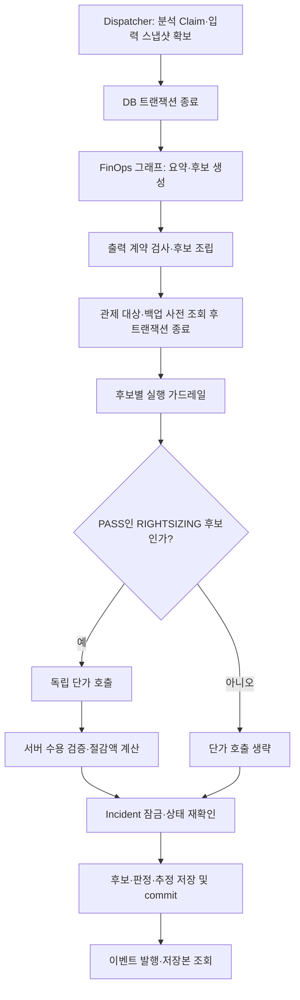

# #347 가드레일 이후 절감 예상 — 구현 계획

작성: 2026-09-16. 상태: 호출 순서에 대한 사용자 결정과 다음 세션의 구현 제안.
현재 제품 코드는 그래프 내부 3호출이며 이 계획의 이동 작업은 미구현이다.
실험 결과와 재사용 근거는 [종합 회고](report.md)에 있다.

## 1. 구현할 결과

FinOps가 생성한 조치 후보의 실행 가드레일을 먼저 수행하고, **PASS인 RIGHTSIZING 후보만** 독립 단가 호출로 보강한다.
AI는 현재·목표 시간당 단가를 추정하고 서버가 월 절감액을 계산한다.
후보·가드레일 결과·절감 예상은 기존 저장·조회 경로에 함께 보존한다.

MVP 구현은 같은 프로세스의 Python 함수 호출로 충분하다. 새 LangGraph·REST API·별도 worker를 만들지 않는다.
호출 위치 변경과 단가 프롬프트 개선을 같은 변경에 넣지 않는다.

## 2. 호출 순서와 트랜잭션

현재 삽입 위치는 `workflows.record_agent_analysis()`의 `guarded` 구성 뒤,
`incidents_repo.lock_incident()` 앞이다. AWS와 모델 호출 동안 DB 트랜잭션을 열어 두지 않는 기존 경계를 유지한다.
Workflow가 순서·분기·저장을 소유하고 Dispatcher가 모델 클라이언트와 입력 스냅샷을 공급한다.
`ai/savings.py`는 모델 요청·응답 수용·계산을 맡으며 DB에 접근하지 않는다.

후속 처리는 우선 **동기식**이다. 정상 분석은 단가 호출이 끝난 뒤 저장·승인 대기로 전이하므로 추가 지연이 남는다.
함수를 그래프 밖으로 옮긴 것만으로 비동기화·프로세스 중단 시 후보 선저장·독립 재시도가 생기는 것은 아니다.
그 수명주기는 기존 Claim 회수 규칙을 유지하며, 별도 저장 후 보강 방식은 이번 계획에 포함하지 않는다.

## 3. 값과 책임

| 값·판정 | 원천·책임 | 후속 처리의 제한 |
| --- | --- | --- |
| 런북·대상·목표 타입·근거 ID | 서버 입력 및 기존 후보 계약을 거친 실행 가드레일 결과 | 통과한 명령과 결속하고 단가 호출이 변경하지 않음 |
| 현재 타입·리전·과금 가정 | 같은 분석에서 확보한 자산 스냅샷·서버 정책 | 모델이 새 대상·사양을 선택하지 않음. 이 스냅샷을 실제 청구 사실로 확대하지 않음 |
| 두 시간당 단가·공개 근거 | 기존 v0.9.1 요청과 AIModelClient | 요청 문구·출력 스키마·모델 설정은 이번 이동에서 유지 |
| 월 절감액 | 서버 Decimal 산술·최종 센트 HALF_UP | `(현재 단가 − 목표 단가) × 730`; 평가 답지로 보정하지 않음 |
| 후보 실행 상태 | 실행 가드레일 판정 | 절감 추정 실패로 PASS를 REJECTED로 바꾸지 않음 |
| 절감 추정 상태 | 단가 호출·수용 결과 | ESTIMATED / UNAVAILABLE / INVALID를 후보 상태와 구분 |

후속 함수의 입력은 대상·현재/목표 사양이 결속된 문맥으로 제한하고 출력은 `AISavingsEstimate`로 둔다.
함수명·주입 타입의 세부는 기존 import 관계를 따라 정하되, Workflow에는 모델 클라이언트를 이용하는 좁은 callable을 주입하는 구성을 우선한다.
callable은 실행 명령이나 후보 상태를 돌려주지 않는다. 전달한 후보의 `candidate_id`에 결과를 붙인다.
대상 불일치나 목표 타입 결속 실패는 모델을 부르기 전에 거절하고 추정 오류로 남긴다.

### 실패와 미적용

| 상황 | 단가 호출 | 저장할 결과 |
| --- | ---: | --- |
| FinOps 그래프 FAILED / NO_PROPOSAL | 0 | 기존 분석 종료 규칙 |
| 후보 가드레일 REJECTED | 0 | 기존 거절 후보·가드레일 결과, 추정 null |
| SecOps / RIGHTSIZING 이외 런북 | 0 | 기존 후보, 추정 null |
| PASS + 정상 단가 | 1 | EXECUTABLE 후보 + ESTIMATED 금액·근거 |
| PASS + 모델이 산출 불가 | 1 | EXECUTABLE 후보 + UNAVAILABLE, 금액 null |
| PASS + 처리 대상 호출 오류·출력 계약 오류 | 최대 1 | EXECUTABLE 후보 + INVALID와 사유, 금액 null |
| 저장 불가인 공개 근거 | 추가 호출 0 | 추정만 INVALID 처리하고 저장 가능한 후보·가드레일 결과 보존 |
| 기존 레코드 | 0 | 저장된 null 또는 추정값 그대로 조회 |

미산출을 0원으로 채우지 않는다. 이미 가드레일이 끝난 후보를 추정 실패 때문에 다시 검증·생성하지 않는다.
기존의 처리 가능한 AIModelError·계약 오류를 분류하며, 예상하지 못한 구현 결함이나 DB 오류까지 무조건 성공으로 숨기지 않는다.

## 4. 구현 순서

### A. 현재 변경과 #324 접점 확인

1. 기존 미커밋 작업을 보존하고 최신 dev와 #324 작업의 변경 범위를 대조한다.
2. 현재 #347 checkout은 `ai/evaluation/summary_prompt_snapshot.json` 등 이관 전 경로를 쓴다.
   #324 작업에는 `common/`, `summary/`, `secops/`가 실제로 있지만 아직 그 이동이 #347에 들어오지 않았다.
3. #324가 함께 수정한 `ai/agent.py`, `agent_dispatcher.py`, `test_agent_dispatcher.py`, `scripts/finops_eval.py`를 파일째 덮어쓰지 않는다.
   공통 계측·summary 이관은 #324 결과를 재사용하고 SecOps 프롬프트 변경을 보존한다.

### B. 기존 FinOps 그래프에서 절감 추정 분리

1. `estimate_savings` 노드와 조건부 연결을 제거하고 `validate_output_contract → END`로 종료한다.
2. `_verified_output()`에서 아직 실행하지 않은 절감 예상의 누락을 INVALID로 만드는 `verify_graph_savings()` 호출을 제거한다.
3. 다운사이징 대상·목표 타입을 서버 정책과 대조하는 기존 후보 검사는 유지한다. 이를 절감 검증과 함께 지우지 않는다.
4. 그래프의 절감 출력 생산·소비 의존을 제거한다. 공유 `RunbookCandidateDraft`의 선택 필드는 기존 실험 로더의 호환성을 먼저 대조한다.
   이번 순서 변경에서 필드 존치가 필요하더라도 운영 Workflow는 그래프가 붙인 추정값을 사용하지 않고 후속 호출의 결과만 저장한다.
5. 오래된 pair/table/3호출 실험의 실행기·원자료·판정은 보존한다. 새 경로의 결과를 과거 실행기 이름으로 기록하지 않는다.

### C. 가드레일 이후 단가 호출 연결

1. 현재 그래프 노드의 호출 코드를 `ai/savings.py`의 독립 진입점으로 옮기고 기존 수용·계산 함수를 재사용한다.
2. Dispatcher가 FinOps 입력 스냅샷과 기존 AIModelClient를 결속해 Workflow에 제공한다.
3. Workflow가 모든 가드레일 결과를 확보한 뒤 PASS + RIGHTSIZING 후보만 골라 호출한다.
4. 검증된 대상·목표 타입과 입력 스냅샷을 대조하고 추정값을 해당 후보에만 붙인다.
5. 기존 `_store_candidate()`와 commit 이후 이벤트 발행을 재사용한다. 실행 `parameters`·`display_parameters`·`validated_command`에 금액을 넣지 않는다.

### D. 지문·호출 규모·기준선 분리

1. FinOps 그래프 지문과 단가 요청 지문을 각각 관리한다. 단가 문구만 바꿨는데 요약 승인 스냅샷이 움직이는 결합을 제거한다.
2. FinOps 요약·추천은 승인 v2를 재사용하는 방향을 우선한다. 현재 v0.9.1에는 요약 문구 변경도 있으므로 단가 노드만 빼고 동일하다고 주장하지 않는다.
3. 승인 v2의 시스템 문구·실제 입력·capabilities·출력 스키마의 title/description/필드 순서·모델 설정을 SDK 요청 경계에서 대조한다.
   같으면 기존 기준선을 유지한다. 다르면 의도하지 않은 차이를 먼저 복원하고, 필요한 변경이 남으면 해당 축의 재통과를 계획한다.
4. 해시 직렬화 형식만 다른 경우에도 옛 방식으로 승인 지문을 재현하고 새 방식과의 대응 근거를 남긴다. 테스트 통과를 위해 승인 내용을 임의 갱신하지 않는다.
5. FinOps 그래프 최대 2회, 후속 단가 최대 1회로 분리한다. 분석 회수 시간 계산은 **전체 분석 최대 호출**을 계속 포함한다.
   SecOps 3호출이 우연히 상한을 맞추는 것에 의존하지 않는다.
6. CLI 규모 안내도 목적별로 나눈다. summary는 60실행 × 2 = 120호출, 단가만은 60회 = 60호출,
   전체 FinOps 대표 흐름은 통과한 RIGHTSIZING 후보당 최대 3호출이다.

## 5. 예상 변경 파일

| 파일·영역 | 변경 |
| --- | --- |
| `apps/core-api/ai/agent.py` | 절감 노드 제거, 요약·후보 전용 그래프·지문·호출 수 정리 |
| `apps/core-api/ai/savings.py` | 독립 단가 호출 진입점, 후보 결속, 기존 수용·계산 재사용 |
| `apps/core-api/agent_dispatcher.py` | 그래프 단계 절감 검증 제거, 후속 호출 주입, 전체 분석 호출 상한 |
| `apps/core-api/workflows.py` | 가드레일 PASS 이후 호출·실패 보존·최종 저장 순서 |
| `packages/schemas/agents.py` 및 관련 소비자 | 그래프 초안과 저장 후보의 책임 분리, 선택 필드 호환성 정리 |
| `packages/schemas/savings.py`, `candidates.py`, `api/incidents.py` | 기존 금액·근거·상태 계약 재사용, 필요한 의미 설명만 정합화 |
| `apps/core-api/ai/tests/` | 그래프 2호출·독립 단가 진입점·지문·SDK 요청 검증 |
| `apps/core-api/tests/test_agent_dispatcher.py` 등 기존 Workflow 테스트 | 가드레일→단가 순서·미호출·실패 보존·조회·전체 분석 상한 |
| `apps/core-api/db/tests/`, `packages/schemas/tests/` | 기존 저장·조회·호환성 규칙 재사용, 새 경계만 추가 |
| `scripts/finops_eval.py`, `scripts/savings_eval.py`, `ai/evaluation/savings/` | 그래프·단가·전체 흐름 계측 경계와 안내 분리 |

DB JSONB 열·mapper·상세 API의 공개 형태는 재사용한다. 순서 이동만을 위한 새 migration은 필요하지 않다.
이미 작성한 migration `c7a9e1d83f24`는 게시 전 최신 dev 및 PR #344와 합칠 순서·head를 대조해야 한다.
`services/aws/**`, FE, Golden 입력, 다중 클라우드 계층의 변경을 이번 이동에 추가하지 않는다.

## 6. 검증 계획

### 무료 검증부터

| 소유 경계 | 검증할 동작 | 이 검증으로 주장하지 않는 것 |
| --- | --- | --- |
| FinOps 그래프 | 정상 경로 2호출, 절감 호출·출력 없음, 후보·근거·서버 목표 보존 | 단가 품질 |
| Workflow | 가드레일 완료 전 단가 호출 0, PASS 뒤 1, REJECTED·비대상·SecOps 0 | 실제 AWS 사전 조건 성공 |
| 후보 결속 | 대상·목표 타입 일치, 다른 후보에 결과를 붙이지 않음, 실행 명령·가드레일 결과 불변 | 현재 가격의 진위 |
| 단가 진입점 | timeout·전송·파싱·UNAVAILABLE·INVALID를 기존 typed 상태로 처리, 후보 보존 | 외부 모델 가용성 |
| SDK 요청 | 이동 전후 단가 요청 동일, 승인 v2의 요약·추천 요청 대조, 스키마 순서 감지 | 실제 모델 품질 |
| 실제 PostgreSQL·새 앱 조회 | 정상·실패·미적용 저장, 후보 실행 상태 보존, 반복 조회 모델 0호출 | 온라인 모델→저장 연속 실행 |
| 트랜잭션·회수 상한 | 모델·AWS 호출 중 DB transaction 없음, 단가 대기 포함 분석 상한 | 비동기 처리·중단점 재개 |

단가 산술·숫자 경계값은 기존 단위 테스트를 재사용하고 Workflow/DB에서 같은 경우를 전수 반복하지 않는다.
새 순서·분기·저장 보존의 위험을 대표 사례로 검증한다. CI 경로의 관련 회귀·필수 전체 검사와 변경 파일 lint를 수행한다.

### 실제 모델 호출은 별도 라운드

1. 위치 이동만으로 정확도가 좋아진다는 가설로 유료 반복을 시작하지 않는다. 기존 v0.9.1 요청의 품질 실패는 남는다.
2. 단가 개선 후보가 정해지면 독립 단가 경계에서 같은 가격 명세로 계측한다. 기존 6사례 × 10회 기준과 별도로 실제로 서로 다른 가격 문맥이 두 조합이라는 한계를 보고한다.
3. 서비스 대표 검증은 실제 DB에서 조립한 입력 → 새 FinOps 그래프 → 가드레일 → 단가 호출 → 저장 → 새 앱 조회를 이어 확인한다.
   실제 AWS 사전검사와 LocalStack·대역 사용 범위를 각각 표시한다.
4. 요약 요청을 승인 v2와 동일하게 복원했다면 가격 개선 때문에 요약 생성·판정 비용을 반복하지 않는다.
   요약 입력·스키마·문구 변경이 남으면 기존 재통과 절차를 따른다.
5. 정확한 후보·호출 수·추정 비용·소요 시간을 정한 뒤 라운드 실행 승인을 받는다. 이전 540호출의 미사용 240회와 완료한 60회 승인을 재사용하지 않는다.

## 7. 이슈·SSOT·버전 처리

2026-09-16 08:53 KST에 [#347 본문](https://github.com/ProjectVigilantis/vigilantis/issues/347)을 갱신하고 재조회했다. [게시 본문 사본](issue-body.md)과 내용이 일치하며 제목·OPEN 상태·기존 메타데이터를 보존했다. 아래 구현 작업은 여전히 미완료다.

- #347은 기능 목표가 그대로여서 새 이슈를 만들 필요가 없다. 기존 제목과 배경·할 일·예상 변경 파일·범위 밖·완료 조건 구성을 유지하고 본문을 갱신한다.
- 변경 핵심은 가드레일 뒤 호출, AI 단가·서버 계산, 실패해도 후보 보존, 독립 단가 계측, 관련 파일·완료 조건이다.
- #324의 summary 이관을 다시 #347 할 일로 넣지 않는다. 실제 이관 경로를 통합 시 재사용한다.
- SSOT의 “금액과 근거 모두 AI” 설명과 공개 API 신설은 PM의 갱신 절차에 연결한다. 이 계획 작성 중 SSOT나 ADR을 임의 개정하지 않는다.
- ADR-0005의 도메인 분리·상태 비보관·그래프 밖 Guardrail/DB 원칙은 유지된다. 이번 이동만으로 새 그래프 ADR은 필요하지 않다.
- 미공개 작업은 v0.x.y 또는 실행 ID·지문으로 추적한다. 첫 PR의 절감 예상 공개판은 v1.0.0이며 기존 승인 요약 v2와 같은 버전 축으로 합치지 않는다.

## 8. 다음 세션의 착수·종료 지점

**착수:** 기존 변경과 #324 접점을 확인한 뒤, 단가 프롬프트는 유지하고 B~D의 호출 위치·지문·상한을 정리한다.

**무료 구현 단계 종료:** 새 순서와 실패 처리·저장 조회·기존 FinOps/SecOps 회귀의 증거를 확보하고,
남은 단가 품질 문제와 실제 모델 검증 계획을 별도로 제시한다.

**기능 완료:** 최종 후보의 합의된 단가 품질, 필요한 요약 기준선, 대표 온라인 흐름, 저장소 필수 검증을 충족한 뒤 판정한다.
현재 이 문서 작성은 구현 완료·가격 품질 합격·PR 준비 완료를 뜻하지 않는다.
