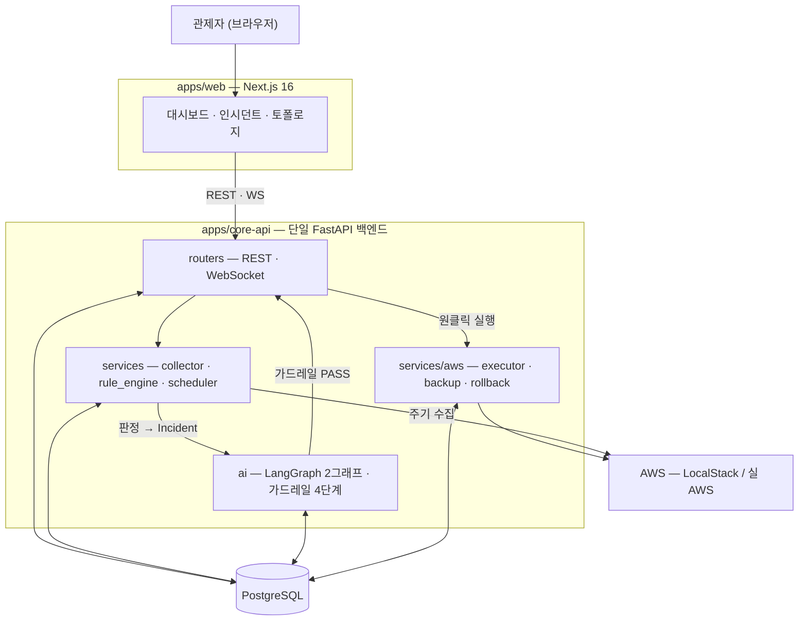

# Vigilantis 프로젝트 기획서

> **상태: 작성 중 (골격)** — 2026-10-01(목) 중간 발표 제출용. 이슈 #335.
> 본문의 사실값은 [`docs/PROJECT_STATUS.md`](PROJECT_STATUS.md)(SSOT)를 원천으로 옮겨 적는다. 충돌하면 SSOT가 이긴다.

| 항목 | 값 |
| --- | --- |
| 문서 | 프로젝트 기획서 (중간 발표 제출본) |
| 작성 | 박지현 (QA & Scenario / Technical Writer) |
| 검토 | 김세혁 (팀장 / PM) |
| 기준일 | *(작성 시점 SSOT 갱신일을 적는다)* |
| 최종 갱신 | *(YYYY-MM-DD)* |
| 직전 제출본 | 2026-09-04(금) 기획 발표 제출본 — WBS가 일정 재편으로 낡아 사실상 재작성 |

<!--
작성 규칙 (#335)
- 기간 표기: `N주차(M/D–M/D)` 형식. 날짜 없는 `N주차` 단독 표기 금지. 범위는 en dash(–).
- 하루를 가리키는 날짜에는 요일: `10/1(목)`.
- 휴일로 구간이 줄면 실작업 일수 병기: `7주차(9/21–9/23 · 실작업 3일)`.
- 인용한 수치·날짜에는 출처를 표기한다.
-->

---

## 1. 개요

### 1.1 한 줄 정의

**Vigilantis는 24/7 AWS 자산·보안 상시 관제 + 4단계 AI 가드레일 기반 원클릭 자율 조치 + 양방향 회복(자동 원복 / 원클릭 해제)을 제공하는 FinSecOps 플랫폼이다.**

"FinSecOps"는 비용 최적화(FinOps)와 보안 대응(SecOps)을 **하나의 조치 파이프라인** 위에 올린다는 뜻이다. 두 축은 탐지 근거와 판단 기준이 다르지만, *탐지 → AI 판단 → 가드레일 검증 → 승인 → 실행 → 회복*이라는 경로를 공유한다.

<!-- 출처: SSOT §한 줄 요약 (2026-09-14 기준) -->

### 1.2 문제 정의와 배경

클라우드 운영에서 **탐지는 이미 충분히 자동화돼 있다.** 유휴 인스턴스도, 열린 보안 그룹도 도구가 찾아 준다. 병목은 그다음이다.

| 단계 | 현재 | 문제 |
| --- | --- | --- |
| 탐지 | 자동 | — |
| 판단 | **사람** | 알림은 쌓이는데 무엇부터 볼지 근거가 없다 |
| 조치 | **사람** | 콘솔·CLI를 직접 친다. 야간·휴일에는 지연이 그대로 노출 시간이 된다 |
| 회복 | **사람** | 조치가 틀렸을 때 되돌릴 근거가 조치자의 기억에 있다 |

그래서 **조치를 자동화하자**는 결론은 쉽게 나온다. 그런데 자동화가 실제로 막히는 이유는 성능이 아니라 **신뢰**다.

1. **되돌릴 수 없는 조치를 기계가 한다** — 인스턴스를 격리하거나 볼륨을 지우는 일은 취소 버튼이 없다.
2. **LLM이 무엇을 할지 자유롭게 정한다** — 자연어 판단을 그대로 실행에 연결하면, 잘못된 대상·잘못된 작업이 통과하는 경로가 열린다.
3. **실패했을 때 되돌릴 근거가 남지 않는다** — 조치 전 상태를 어디에도 적어 두지 않으면 원복은 사람의 기억에 의존한다.

**Vigilantis의 전제는 "AI에게 실행 권한을 주되, AI가 통과할 수 있는 문을 좁힌다"이다.**

- AI는 **무엇을 할지 고르지 않는다.** 미리 등재된 **런북 10종** 중에서 **고른다**(Action Whitelist).
- 고른 결과는 실행 전에 **4단계 가드레일**(Schema Check → Action Whitelist → ARN Match → AWS Dry-Run)을 순서대로 통과해야 한다.
- 조치 **전에** 원래 상태를 백업 레코드로 남긴다. 원복 파라미터는 AI도 화면도 아닌 **그 레코드에서만** 온다.
- 실패하면 **시스템이 스스로 되돌리고**(자동 원복), 보안 차단은 관제자가 **원클릭으로 해제**한다(양방향 회복).

<!-- TODO: 2026-09-04(금) 제출본의 문제 정의 절과 대조해 논지·표현이 어긋나지 않는지 확인한다 (로컬 볼트) -->

### 1.3 목표와 비목표

#### 목표 (MVP · 2026-10-01(목) 중간 발표 시연 범위)

| # | 목표 | 확인 방법 |
| --- | --- | --- |
| 1 | AWS 단일 계정 / 1–2개 리전의 자산·보안 상태를 주기 수집해 판정한다 | Golden Dataset 판정 정답 대조 |
| 2 | 판정 결과를 AI가 읽고 **CoT 3줄 요약 + 런북 추천**을 낸다 | AI 산출 정답지 회귀 |
| 3 | 추천이 **4단계 가드레일**을 순서대로 통과해야 승인 대기로 올라간다 | 가드레일 단계별 기록 |
| 4 | 관제자가 **원클릭으로 실행**하고 결과가 AWS에 실제로 반영된다 | E2E 시나리오 T1·T2 |
| 5 | 실패 시 **자동 원복**, 보안 차단은 **원클릭 해제**로 되돌린다 | E2E 시나리오 T1·T2 |
| 6 | 조치별 **절감 예상 금액과 그 산출 근거**를 함께 제시한다 | 저장된 근거 필드 조회 |

<!-- 출처: SSOT §MVP 확정 범위 -->

#### 비목표 (이번 범위 밖)

**빠진 것이 아니라 뺀 것이다.** 각 항목은 확정 결정으로 범위 밖에 두었다.

| 범위 밖 | 사유 | 언제 |
| --- | --- | --- |
| 실환경 GuardDuty 연동 | MVP는 Golden Dataset 기반 **모의(Mock) 주입**으로 위협을 넣는다 | Post-MVP |
| 비용 추이 그래프 · 누적 절감 캘큘레이터 | 절감 예상은 **개별 추천 하나**에 한한다. 집계·추이 축은 별개 기능이다 (2026-09-07 확정) | Post-MVP |
| 근거 조회 · 시계열 차트 · 시간 슬라이드 차트 | 2026-09-03 회의에서 현 마일스톤 카드에서 제외 | 추후 |
| 다중 계정 / 전 리전 관제 | 단일 계정 · 1–2개 리전으로 고정 | Post-MVP |

<!-- 출처: SSOT §MVP 확정 범위 — 「이번 범위 밖」 항목과 §확정 결정 로그 -->

---

## 2. 서비스 범위 (MVP)

<!-- 원천: SSOT §MVP 확정 범위 · §Action Whitelist 표 -->

### 2.1 핵심 3축

§1.2의 전제 — *AI에게 실행 권한을 주되 통과할 문을 좁힌다* — 를 세 축으로 구현한다.

| 축 | 무엇을 하나 | 이 축이 지키는 것 |
| --- | --- | --- |
| ① 상시 관제 | 자산·보안 상태를 주기 수집해 판정한다 | 판단의 **근거**가 사람 기억이 아닌 데이터에 있다 |
| ② 4단계 가드레일 | AI 추천을 실행 전에 순서대로 검증한다 | AI가 **고를 수 있는 범위**를 좁힌다 |
| ③ 양방향 회복 | 조치를 되돌리는 경로를 미리 만들어 둔다 | 되돌릴 **근거**가 조치 전에 남는다 |

#### 축 ① 상시 관제 — 무엇을 보고 무엇으로 판정하나

| 항목 | 범위 |
| --- | --- |
| 계정 · 리전 | AWS **단일 계정 / 1–2개 리전** |
| 관제 대상 | **EC2 · SG 중심** + 런북 조치 대상 리소스(NACL, EBS, ASG · Launch Template, ALB Target Group) |
| 위협 유형 | **OpenIP(`0.0.0.0/0`) · SSH 브루트포스** 2종 — Golden Dataset 기반 **모의(Mock) 주입** |
| 수집 주기 | APScheduler 기반 주기 스캔 |

**3단계 위험 대응** — 위험도에 따라 사람이 개입하는 지점이 달라진다.

| 위험도 | 처분 | 사람의 개입 |
| --- | --- | --- |
| High | `PRE_MITIGATION_0_5S` — 0.5초 선차단 시뮬레이션 | 차단 **후** 확인 |
| Medium | `AGENT_WAIT` — 승인 대기 · **1분 미응답 시 `TIMEOUT_ISOLATION_1M`(자동 격리)** | 승인 |
| Low | `AGENT_WAIT` — 승인 대기 (**자동 격리 없음**) | 승인 |

> **화면 표기**: Medium 대기 화면에는 **초 단위 카운트다운을 두지 않는다.** `제안 생성 시간` · `실행 예정 시간` **절대 시각 2종**만 보여준다(2026-08-27 확정).

#### 축 ② 4단계 가드레일 — AI가 통과해야 하는 문

**순서가 고정돼 있다.** 앞 단계를 건너뛰는 경로는 없다.

| # | 단계 | 무엇을 검사하나 | 여기서 막히는 것 |
| --- | --- | --- | --- |
| ① | Schema Check | AI 출력이 Pydantic v2 계약을 만족하는가 | 형식이 깨진 출력 |
| ② | Action Whitelist | `Runbook ID`가 등재된 10종 안에 있는가 | **표에 없는 조치** — AI가 새 작업을 지어내는 경로 |
| ③ | ARN Match | 조치 대상 ARN이 수집된 자산과 일치하는가 | 존재하지 않거나 **엉뚱한 대상** |
| ④ | AWS Dry-Run | 실제 AWS가 이 호출을 받아들이는가 | 권한·파라미터 오류 |

> ⚠️ **④ Dry-Run 통과는 대상 자원의 존재를 증명하지 않는다** — 부재 자원에도 `DryRunOperation`이 돌아온다(ADR-0007 1차 개정 · 2026-08-25 실측). 대상 존재는 ③이 책임진다. **Dry-Run 미지원 런북 5종은 조회로 대체 검증**한다(ADR-0007 §5).

#### 축 ③ 양방향 회복 — 되돌리는 두 경로

| 축 | 경로 | 발동 주체 |
| --- | --- | --- |
| 자산 (FinOps) | 스펙 JSON 백업 ➔ `get_waiter` **Status Check 2/2** ➔ 실패 시 **자동 원복** | **시스템** |
| 보안 (SecOps) | 선제 차단 ➔ 관제자 **[원클릭 해제]** | **관제자** |

**원복 파라미터는 AI도 화면도 아닌 DB 백업 레코드(`backup_record_id`)에서만 온다.** 조치 *전에* 남긴 값이므로, 조치 후 상태가 무엇이든 되돌릴 근거가 보존된다.

> **레콘(Reckon)** — 가드레일이 *실행해도 되는가*를 묻는다면, 그 다음 두 물음 *실제로 무엇이 일어났는가* → *그 결과를 어떻게 수습·종료하는가* 를 다루는 **Incident 상태와 그 상태를 관리하는 일련의 과정**을 부르는 고유명사다. '가드레일'과 같은 층위로 쓴다(2026-09-03 확정).

#### AI 계층

| 항목 | 값 |
| --- | --- |
| 모델 | OpenAI `gpt-5.6-luna` (`reasoning_effort=low`) |
| 출력 계약 | Pydantic v2 **Structured Output** |
| 오케스트레이션 | **LangGraph** — 프로젝트 정체성으로 MVP 구현 확정(2026-08-13) |
| 산출 | **CoT 3줄 요약 + Runbook ID 추천** |
| 조치별 절감 예상 | **금액과 산출 근거를 모두 AI가 낸다**(추천 호출에 함께). 근거는 구조화 필드로 **저장해 두고 재사용** — 볼 때마다 다시 부르지 않는다(2026-09-07 확정) |

### 2.2 Action Whitelist — 런북 10종 (본편 7 + 롤백 3)

**여기 없는 Runbook ID는 실행 경로에 진입할 수 없다**(가드레일 ②). 이 표가 확정본이며, 코드와 어긋나면 표를 기준으로 코드를 고친다.

| 분류 | Runbook ID | 위험도 / 승인 | AI 추천 | 등록 롤백 |
| --- | --- | --- | --- | --- |
| SecOps | `RUNBOOK_EC2_ISOLATE` | High / 0.5초 선차단 · 1분 타임아웃 | ✅ | `RUNBOOK_EC2_UNISOLATE` |
| SecOps | `RUNBOOK_NACL_ADD_DENY` | Medium / 관제자 승인 | ✅ | — (해제는 `NACL_RESTORE` 주 조치 경로) |
| SecOps | `RUNBOOK_NACL_RESTORE` | Low / 관제자 승인 (원클릭 해제) | ✅ | — |
| SecOps | `RUNBOOK_SG_DELETE_ISOLATED` | Medium / 관제자 승인 | ✅ | `RUNBOOK_SG_RECREATE` |
| FinOps | `RUNBOOK_EC2_RIGHTSIZING` | Medium / 관제자 승인 (자동 원복 시연 대상) | ✅ | `RUNBOOK_EC2_REVERT_SIZE` |
| FinOps | `RUNBOOK_EC2_ENABLE_AUTOSCALING` | Medium / 관제자 승인 (stateless 한정 구조 전환) | ✅ | — |
| FinOps | `RUNBOOK_EBS_DELETE_UNATTACHED` | Low / 관제자 승인 | ✅ | — |
| 롤백 | `RUNBOOK_EC2_UNISOLATE` | Medium / 관제자 승인 (원클릭 해제) | ❌ | — |
| 롤백 | `RUNBOOK_SG_RECREATE` | Low / 관제자 승인 | ❌ | — |
| 롤백 | `RUNBOOK_EC2_REVERT_SIZE` | High / **시스템 자동 발동**(Status Check 실패 시) 또는 관제자 수동 요청 | ❌ | — |

> **분류 축 주의**: 위 `분류`는 Runbook Registry 축(`FINOPS` · `SECOPS` · `ROLLBACK`)이며 **Incident 분류(`FINOPS` · `SECOPS`)와 별개**다. 롤백 3종은 Registry에서 `ROLLBACK` 단일 도메인으로 묶인다.

**롤백 런북 공통 정책** (2026-08-13 확정 · [ADR-0004](adr/0004-rollback-runbook-whitelist-registration.md))

1. **Whitelist 정식 등록** — 롤백이라고 가드레일을 우회하지 않는다. 우회 경로 자체가 없다.
2. **`ai_recommendable: false`** — AI 추천 목록에서 제외. 트리거는 **시스템 또는 관제자**만이다.
3. **원복 파라미터는 DB 백업 레코드에서만 로드** — AI 출력도 화면 입력도 원복 값의 출처가 될 수 없다.
4. **롤백이 가드레일에서 거절되면 자동 재시도 없이 CRITICAL 알림 + 수동 개입** — 되돌리기 실패를 조용히 삼키지 않는다.

### 2.3 범위 경계

기능 축의 비목표는 §1.3에 적었다. 여기서는 **MVP 안에서의 경계**를 못 박는다.

| 축 | MVP 경계 | 넘어가면 |
| --- | --- | --- |
| 계정 · 리전 | 단일 계정 / 1–2개 리전 | Post-MVP |
| 위협 입력 | Golden Dataset 기반 **모의 주입** 2종 | 실환경 GuardDuty 연동 = Post-MVP |
| 조치 | **등재된 10종만** | 런북 추가는 ADR로 등재해야 한다(ADR-0002 · ADR-0004) |
| 절감 예상 | **개별 추천 하나**의 금액과 근거 | 집계 · 추이 축 = Post-MVP |
| 시연 환경 | **LocalStack**(2026-10-01(목) 중간 발표) — 사유는 §4.4 | 실 AWS 스모크 = 9주차(10/02–10/08) |

**최종 발표 2026-12-11(금)에 Post-MVP 범위까지 배포·시연한다.** 그 범위는 중간 발표 뒤에 확정한다.

---

## 3. 시스템 아키텍처

### 3.1 구성도

<!--
원천: ADR-0001(단일 FastAPI 백엔드·모노레포) · SSOT §MVP 확정 범위 아키텍처 절
TODO: 제출용 변환본(Word)에서는 mermaid가 렌더되지 않는다 — 이미지로 바꿔 넣는다
-->

**조치 한 건이 지나는 경로는 하나다.**

`주기 수집` → `규칙 판정` → `Incident 생성` → `AI 요약·런북 추천` → `가드레일 4단계` → `관제자 승인` → `실행` → `회복(자동 원복 / 원클릭 해제)`

### 3.2 기술 스택

<!-- 원천: SSOT §MVP 확정 범위 · ADR-0001 · ADR-0003 · ADR-0005 · ADR-0006 -->

| 층 | 채택 | 근거 |
| --- | --- | --- |
| **백엔드** | **단일 FastAPI** (`apps/core-api`) | ADR-0001 |
| DB | PostgreSQL + Alembic | ADR-0001 |
| 스케줄러 | APScheduler (앱 `lifespan` 배선 · advisory lock으로 중복 실행 방지) | SSOT |
| **프론트엔드** | **Next.js 16**(App Router · Turbopack) + React 19 + TypeScript + **Tailwind CSS v4** + shadcn UI | ADR-0003 |
| **AI 모델** | OpenAI `gpt-5.6-luna` (`reasoning_effort=low`) | SSOT |
| AI 출력 계약 | **Pydantic v2 Structured Output** | SSOT |
| AI 오케스트레이션 | **LangGraph** — 도메인별 2그래프 | ADR-0005 |
| AWS 제어 | boto3 (`AWS_ENDPOINT_URL` 스위치 하나로 LocalStack ↔ 실 AWS) | ADR-0006 |
| **개발·시연 환경** | **LocalStack**(단일 compose · 버전 고정 · Boto3 시드 단일 원천) | ADR-0006 |
| 공통 스키마 | `packages/schemas` — FE↔BE 계약의 코드 원천 | ADR-0001 |
| 테스트 | pytest(BE) · `node --test`(FE) | — |
| CI | GitHub Actions **3잡** — `test` · `web` · `ai-signature` | SSOT |

### 3.3 주요 설계 결정 (ADR)

**이 프로젝트는 설계 결정을 문서로 남긴다.** 8건이 저장소 [`docs/adr/`](adr/)에 있고, 각 ADR은 *무엇을 정했나* 와 *무엇을 버렸나* 를 함께 적는다. 아래는 그 요약이며, 배경·대안 비교·개정 이력은 원문에 있다.

| ADR | 날짜 | 결정 | 이 결정이 막는 것 |
| --- | --- | --- | --- |
| [0001](adr/0001-mvp-monorepo-structure.md) | 2026-08-11 | **MVP는 단일 FastAPI 백엔드로 통합한다** — 앱 4개(마이크로서비스) 구조를 `apps/core-api` 하나로 | 단일 계정·1–2개 리전 범위에 Step Functions·Lambda를 얹어 **서비스 간 배포·통신 비용이 개발 속도를 먹는 것** |
| [0002](adr/0002-runbook-whitelist-mvp-scope.md) | 2026-08-12 | **Action Whitelist를 레지스트리 7종으로 확정**하고 전부 MVP 범위로 (→ 0004로 10종) | 조치 범위가 *예시* 로만 남아 **AI 엔진과 Boto3 제어가 서로 다른 목록을 보고 개발되는 것** |
| [0003](adr/0003-fe-stack-nextjs-16.md) | 2026-08-13 | **FE 스택을 Next.js 16 + React 19 + Tailwind v4 + shadcn 4로** | 동결된 Next 14 라인 위에서 **컴포넌트를 추가할 때마다 수동 구성 부담**을 지는 것 |
| [0004](adr/0004-rollback-runbook-whitelist-registration.md) | 2026-08-13 | **롤백 3종도 Whitelist에 정식 등록한다(7→10종)** — 우회 경로를 만들지 않는다 | **가드레일이 우리 자신의 자동 원복을 차단**하는 것. 우회로를 뚫었다면 *되돌리기* 만 검증 없이 도는 구멍이 생긴다 |
| [0005](adr/0005-langgraph-stateless-domain-graphs.md) | 2026-08-18 | **LangGraph를 상태 없는 도메인별 두 그래프로** — 상태 원천은 그래프가 아니라 **DB** | 그래프 Checkpointer가 **제2의 상태 원천**이 되어, AWS를 실제로 바꾼 뒤 *무엇이 근거였나* 를 사후에 설명할 수 없게 되는 것 |
| [0006](adr/0006-localstack-team-standard-env.md) | 2026-08-19 | **LocalStack을 팀 표준 환경으로** — 단일 compose · 시드 단일 원천 · `AWS_ENDPOINT_URL` 스위치 | 통합 테스트가 **개인 PC에서만 통과**하고 CI에서는 조용히 전부 skip되는 것 |
| [0007](adr/0007-guardrail-dryrun-executor-precheck-contract.md) | 2026-08-24 | **가드레일 ④는 executor의 단일 `precheck()` 호출로 판정한다** — Dry-Run 미지원 작업은 **조회로 대체 검증** | 가드레일(AI 소유)과 executor(Infra 소유)의 **경계에 규약이 없어 양쪽이 서로를 기다리는 것** |
| [0008](adr/0008-backup-record-lifecycle-recovery-integrity.md) | 2026-09-02 | **백업은 조치 직전 1회 캡처·불변 보존**하고, **원복 재개는 시간이 아니라 상태 대조로** 판단한다 | 원복의 유일한 근거가 *어디서 읽는가* 만 정해지고 **언제 만들고 무엇과 대조하는가가 빈 채로** 자동 원복이 붙는 것 |

**세 ADR이 §1.2의 「신뢰」 3가지에 그대로 대응한다.**

| §1.2의 위험 | 답 |
| --- | --- |
| 되돌릴 수 없는 조치를 기계가 한다 | **ADR-0008** — 조치 *전에* 백업을 남기고 불변으로 보존 |
| LLM이 무엇을 할지 자유롭게 정한다 | **ADR-0002 · 0004** — 등재된 10종 밖으로 나갈 경로가 없다 |
| 실패했을 때 되돌릴 근거가 없다 | **ADR-0004 ③ · 0008** — 원복 파라미터는 **DB 백업 레코드에서만** 온다 |

> **ADR은 살아 있는 문서다.** 0002·0004·0006·0007은 실측이 쌓이며 개정됐고(0006은 5차까지), **개정 이력이 본문 하단에 남는다.** 핵심 결정은 불변이고 바뀐 것은 대상 목록·검증 한계·좌표다.

<!-- TODO: ADR-0009(실 AWS 계정·키·비용 통제)는 PR #348 머지 시 9번째 행 추가 -->

### 3.4 API 계약 개요

<!-- 원천: SSOT §API 계약 (코드 원천: packages/schemas/api/) -->

**FE↔BE 공개 계약은 코드가 원천**(`packages/schemas/api/`)이고 문서는 그 요약이다.

| 엔드포인트 | 담는 것 |
| --- | --- |
| `GET /api/v1/assets` | EC2/SG 상태·스펙·연결관계 · 헬스 스코어(**0–100 정수**) · Skip 사유 코드 **6종** |
| `GET /api/v1/incidents` | 목록 — 상세의 부분집합 10필드. `status`·`category` 필터, `created_at` 내림차순 |
| `GET /api/v1/incidents/{id}` | **AI CoT 3줄 요약** · Evidence ID · 추천 런북(**본편 7종만**) · 실행 요약(복구 조치는 **롤백 3종만**) |
| `POST /api/v1/actions/execute` | Request는 **`{incident_id, runbook_id, idempotency_key}` 셋뿐** — 신규 `202`, 같은 키 재요청 `200`(멱등 재생) |
| `WebSocket /api/v1/ws` | `INCIDENT_CREATED` · `INCIDENT_UPDATED` · `EXECUTION_UPDATED` — **DB commit 이후 전송, 상태 원본이 아니다** |

**계약이 지키는 두 가지가 §1.2의 전제와 이어진다.**

1. **실행 요청은 Target ARN도 AWS 파라미터도 받지 않는다.** 무엇을 어디에 할지는 서버가 Incident와 백업 레코드에서 정한다 — 화면이 조작돼도 조치 대상이 바뀌지 않는다.
2. **화면 표시용 값(`display_parameters`)은 서버가 typed `parameters`에서 파생한다.** LLM이 짓지 않고, 실행 요청으로 되돌려 받지도 않는다.

실행 상태는 **7종**이다 — `IN_PROGRESS` · `SUCCESS` · `FAILED` · `ROLLBACK_INITIATED` · `ROLLED_BACK` · `ROLLBACK_FAILED` · **`UNVERIFIED`**(AWS 조회 실패로 결과를 판정하지 못한 종료 상태 — 자동 원복하지 않고 관제자 복구를 연다).

<!-- UNVERIFIED는 #249 / PR #341로 2026-09-14 머지됐다. SSOT §API 계약의 6종 표기는 PR #354가 7종으로 갱신 중이다 -->

---

## 4. 검증 전략

### 4.1 Golden Dataset

<!--
원천: SSOT §MVP 확정 범위 — Golden Dataset 현재값(2026-09-14 실측 · 이슈 #310).
⚠️ 「28건」 한 숫자로 적지 않는다 — 답이 셋이고 뜻이 다르다.
  ① 입력 자산 32건 (datasets/golden/finops/input/ · 유형 7/7종)
  ② 판정 정답 28건 (규칙 엔진 판정 정답이 있는 자산. 차이 4건은 그래프 노드 전용 유형)
  ③ SecOps 이벤트 16건 (입력 16 / 정답 16)
이 문서가 4주차까지 써 온 「28건」과 ②의 28은 숫자만 같고 뜻이 다르다.
-->
*(TODO)*

### 4.2 E2E 시연 시나리오 (T1 · T2)

<!-- 원천: docs/E2E_DEMO_SCENARIOS.md -->
*(TODO)*

### 4.3 CI 구성

<!-- 원천: CLAUDE.md §PR 규칙 — test 잡(pytest + LocalStack·PostgreSQL service container) / web 잡(ESLint · next build · node --test) -->
*(TODO)*

### 4.4 10/1(목) 시연 환경이 LocalStack인 이유

<!--
#335 DoD 필수 항목. **의도된 선택으로 서술한다 — 미비로 읽히게 적지 않는다**(2026-09-14 결정).
실 AWS 스모크는 9주차(10/02–10/08)로 이동했다는 점까지 함께 적는다.
-->
*(TODO)*

---

## 5. 개발 일정 (WBS) 🔴 필수 항목

> ⚠️ **PM 확정값 대기 중.** 이 장의 모든 값은 SSOT §현재 위치 주차 표를 원천으로 옮겨 적는다.
> 2026-09-16(수) 회의의 역할 재배치와 부재 일정이 반영된 SSOT 갱신본을 받은 뒤 채운다.

### 5.1 발표 일정과 마일스톤

<!-- 원천: SSOT §발표 일정 — 기획 9/4(금) 완료 · 중간 10/1(목) MVP 시연 · 최종 12/11(금) -->
*(TODO — PM 확정 대기)*

### 5.2 주차별 WBS

<!--
원천: SSOT §현재 위치 주차 표. 6주차(9/14–9/18)부터 10주차(10/12–10/15)까지.
휴일 누락 금지: 추석 9/24(목)–9/25(금) · 개천절 대체 10/5(월) · 한글날 10/9(금).
-->
*(TODO — PM 확정 대기)*

### 5.3 일정 리스크와 대응

<!--
방침: 범위 축소가 아니라 인력 재배치(SSOT §일정 리스크).
인원 변동 2건과 그 인수인계 체계를 적는다 — 숨기지 않는 쪽이 배점 ③에서 유리하다.
-->
*(TODO)*

---

## 6. 팀 구성 및 역할분담 (R&R) 🔴 필수 항목

> ⚠️ **PM 확정값 대기 중.** SSOT §팀 & 역할 표와 어긋나면 안 된다(#335 DoD).

### 6.1 역할 표

<!-- 원천: SSOT §팀 & 역할 — 이름 · 역할 · 담당 DOMAIN. 부재·인수인계는 비고 열에 적는다 -->
*(TODO — PM 확정 대기)*

### 6.2 복수 담당 접점

<!-- 원천: SSOT §팀 & 역할의 `복수 담당 접점` 표 — SEC · SCHEMA · API 계약 -->
*(TODO — PM 확정 대기)*

### 6.3 협업 규약

<!-- 원천: CLAUDE.md — 브랜치명·커밋·PR·리뷰/머지·이슈 CLOSE 규약·SSOT 주 2회 갱신 -->
*(TODO)*

---

## 7. 기대 효과

*(TODO)*

---

## 8. 부록

### 8.1 용어

*(TODO)*

### 8.2 문서 지도

<!-- 원천: SSOT §문서 지도 (신뢰 우선순위) -->
*(TODO)*

### 8.3 참고

*(TODO)*

<!--
■ 남은 확인 사항
1. 심사 배점표 전체 — #335에 ③ 실현 가능성 15점 · ⑤ 팀 구성·역할분담 10점만 적혀 있다.
   나머지 항목과 배점은 2026-09-04 제출본에서 대조해 목차를 맞춘다.
2. ADR-0009(실 AWS 계정·키·비용 통제) — PR #348 머지 시 §3.3에 9번째 행 추가.
-->
