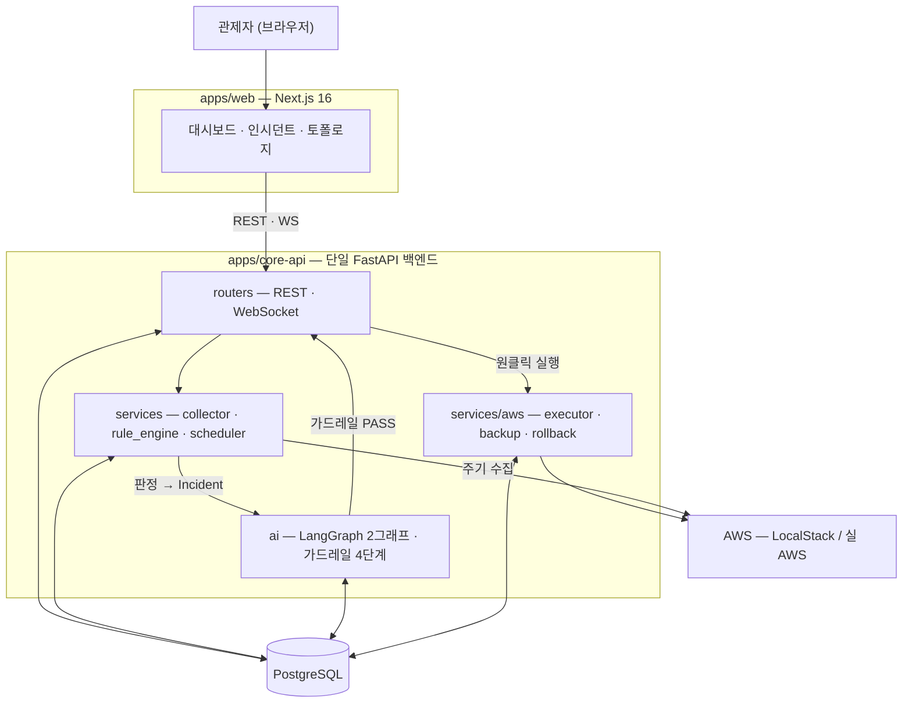

# Vigilantis 프로젝트 기획서

> **상태: 작성 중 (골격)** — 2026-10-01(목) 중간 발표 제출용. 이슈 #335.
> 본문의 사실값은 [`docs/PROJECT_STATUS.md`](PROJECT_STATUS.md)(SSOT)를 원천으로 옮겨 적는다. 충돌하면 SSOT가 이긴다.
>
> **출처 표기 규칙** — 각 절 머리에 `> **출처** — …` 한 줄로 그 절의 값이 어디서 왔는지 밝힌다.
> **프로젝트 사실값**(범위·결정·역할·현황·계약)의 원천은 셋뿐이다: **SSOT**(`docs/PROJECT_STATUS.md`) · **`docs/adr/`** · **`packages/schemas/`**. 저장소 밖 문서를 프로젝트 사실의 기준으로 삼지 않는다 — 대조할 수 없는 기준은 기준이 아니다.
> **외부 시장·통계**는 다른 축이다. 저장소가 답을 갖고 있지 않으므로 인용하되, **기관명·조사명·연도를 표 아래에 명시**한다.

| 항목 | 값 |
| --- | --- |
| 문서 | 프로젝트 기획서 (중간 발표 제출본) |
| 작성 | 박지현 (QA & Scenario / Technical Writer) |
| 검토 | 김세혁 (팀장 / PM) |
| 기준일 | *(작성 시점 SSOT 갱신일을 적는다)* |
| 최종 갱신 | *(YYYY-MM-DD)* |
| 직전 제출본 | 2026-09-04(금) 기획 발표 제출본 — WBS가 일정 재편으로 낡아 사실상 재작성 |

<!--
작성 규칙 (#335)
- 기간 표기: `N주차(M/D–M/D)` 형식. 날짜 없는 `N주차` 단독 표기 금지. 범위는 en dash(–).
- 하루를 가리키는 날짜에는 요일: `10/1(목)`.
- 휴일로 구간이 줄면 실작업 일수 병기: `7주차(9/21–9/23 · 실작업 3일)`.
- 인용한 수치·날짜에는 출처를 표기한다.
-->

---

## 1. 개요

### 1.1 한 줄 정의

**Vigilantis는 24/7 AWS 자산·보안 상시 관제 + 4단계 AI 가드레일 기반 원클릭 자율 조치 + 양방향 회복(자동 원복 / 원클릭 해제)을 제공하는 FinSecOps 플랫폼이다.**

"FinSecOps"는 비용 최적화(FinOps)와 보안 대응(SecOps)을 **하나의 조치 파이프라인** 위에 올린다는 뜻이다. 두 축은 탐지 근거와 판단 기준이 다르지만, *탐지 → AI 판단 → 가드레일 검증 → 승인 → 실행 → 회복*이라는 경로를 공유한다.

> **출처** — SSOT §한 줄 요약 (2026-09-14 기준)

### 1.2 문제 정의와 배경

> **출처** — 페르소나·시장 분석은 2026-09-04(금) 기획 발표 제출본 §02·§03에서 옮겼다. 인용 통계의 원출처는 각 표 아래에 밝힌다.

#### 1.2.1 누가 겪는 문제인가 — 인프라가 「다른 영역」인 회사

**개발로 성공해 구색을 갖춘 중소기업**이다. 보유 역량은 **개발에 통달한 전문 개발자** — 그러나 **인프라는 다른 영역**이다.

> **개발 10년차라도, 인프라 구축·유지보수에서는 신입이다.**

그리고 성공이 문제를 만든다.

| | |
| --- | --- |
| **STEP 1** | 바쁜 일정 중 공부해서 **소규모 인프라는 어떻게든** 관리하게 됐다 |
| **STEP 2** | 사업이 성공해 **인프라를 추가로 구성·관리**해야 한다 |
| **STEP 3** | 사장은 **추가 인건비를 쓰고 싶지 않다** |

**STEP 3이 이 프로젝트의 출발점이다.** 인프라가 늘어난 만큼 사람을 늘리는 선택지가 실제로는 닫혀 있다.

#### 1.2.2 왜 전문 인력을 뽑지 않는가 — 조건이 다르다

| 축 | 🏢 대기업 | 🏪 중소기업 |
| --- | --- | --- |
| **자본** | 인프라 투자를 **예산 항목**으로 편성 | **고정비 한 줄이 손익에 그대로** 반영 |
| **인프라 형태** | 온프레미스·하이브리드까지 **직접 운용** | **퍼블릭 클라우드 한 곳**에 의존 |
| **인력** | 안정성 **전담 조직(SRE)을 따로** 둔다 | 전담 없이 **겸업·외주**로 대응 |

**숫자 둘이 그 조건을 보여 준다.**

| | 값 | 뜻 |
| --- | --- | --- |
| 전담 인프라 인력 1명 | **연 6,000만 원** | 5년차 5,000만 + 4대보험·퇴직금 |
| 전담 없이 대응하는 국내 기업 | **71.4%** | 겸업 **63.6%** + 외주 **7.8%** |

> **인용 출처** — 과학기술정보통신부·KISIA 「정보보호 실태조사」(전담 인력 미보유) · 원티드 DevOps 직무 연봉 데이터(2025)

**대다수가 고른 답은 「겸업 유지」다** — 사람을 새로 뽑는 대신 **있는 개발자에게 인프라를 얹는다.** 인건비는 그만큼 오르고, 그 개발자는 **인프라에서는 여전히 신입**이다.

> **여러분이 중소기업 사장이라면, 추가 인력을 뽑는 결정을 쉽게 내릴 수 있습니까?**

**그리고 그 회사들의 클라우드 사용량은 늘고 있다.**

| | 값 | 뜻 |
| --- | --- | --- |
| 국내 클라우드 시장 | **99.5억 → 382.8억 달러** | 2025년 → 2031년 전망 |
| **중소기업 세그먼트** | **CAGR 27.2%** | 전체 시장보다 빠르다 — 관리형 DevOps 수요 증가가 근거 |

사업이 커지면 인프라 사용량이 함께 커지는 구조이기 때문이다. **고객사가 늘면 이벤트 처리량이 그대로 인프라 부하가 된다.**

> **클라우드 사용은 빠르게 늘지만, 그것을 관리할 사람은 늘지 않는다.**

<!-- TODO: 시장 수치의 원출처(조사기관·보고서명)를 9/4 발표자 (김세혁)에게 확인해 표 아래에 명시한다. ⑦ 배점이 출처 명확성을 본다 -->

**그래서 이 프로젝트가 풀려는 문제는 「관제를 더 잘하는 법」이 아니라 「관제 인력을 늘리지 않고도 관제가 유지되는 법」이다.**

#### 1.2.3 그렇다면 무엇이 병목인가

클라우드 운영에서 **탐지는 이미 충분히 자동화돼 있다.** 유휴 인스턴스도, 열린 보안 그룹도 도구가 찾아 준다. 병목은 그다음이다.

| 단계 | 현재 | 문제 |
| --- | --- | --- |
| 탐지 | 자동 | — |
| 판단 | **사람** | 알림은 쌓이는데 무엇부터 볼지 근거가 없다 |
| 조치 | **사람** | 콘솔·CLI를 직접 친다. 야간·휴일에는 지연이 그대로 노출 시간이 된다 |
| 회복 | **사람** | 조치가 틀렸을 때 되돌릴 근거가 조치자의 기억에 있다 |

**겸업 담당자에게는 이 세 단계가 특히 비싸다.** 본업이 따로 있어 알림을 제때 못 보고, 인프라가 주 전공이 아니라 판단에 시간이 더 걸리며, 되돌리는 절차는 평소에 쓰지 않아 몸에 배어 있지 않다.

#### 1.2.4 자동화를 막는 것은 성능이 아니라 신뢰다

그래서 **조치를 자동화하자**는 결론은 쉽게 나온다. 그런데 자동화가 실제로 막히는 이유는 성능이 아니라 **신뢰**다.

1. **되돌릴 수 없는 조치를 기계가 한다** — 인스턴스를 격리하거나 볼륨을 지우는 일은 취소 버튼이 없다.
2. **LLM이 무엇을 할지 자유롭게 정한다** — 자연어 판단을 그대로 실행에 연결하면, 잘못된 대상·잘못된 작업이 통과하는 경로가 열린다.
3. **실패했을 때 되돌릴 근거가 남지 않는다** — 조치 전 상태를 어디에도 적어 두지 않으면 원복은 사람의 기억에 의존한다.

**Vigilantis의 전제는 "AI에게 실행 권한을 주되, AI가 통과할 수 있는 문을 좁힌다"이다.**

- AI는 **무엇을 할지 고르지 않는다.** 미리 등재된 **런북 10종** 중에서 **고른다**(Action Whitelist).
- 고른 결과는 실행 전에 **4단계 가드레일**(Schema Check → Action Whitelist → ARN Match → AWS Dry-Run)을 순서대로 통과해야 한다.
- 조치 **전에** 원래 상태를 백업 레코드로 남긴다. 원복 파라미터는 AI도 화면도 아닌 **그 레코드에서만** 온다.
- 실패하면 **시스템이 스스로 되돌리고**(자동 원복), 보안 차단은 관제자가 **원클릭으로 해제**한다(양방향 회복).

**이 넷이 §1.2.2의 답이다** — 사람을 늘리지 않고 관제를 유지하려면 조치까지 자동이어야 하고, 조치가 자동이려면 **되돌릴 수 있어야** 한다.

### 1.3 목표와 비목표

#### 목표 (MVP · 2026-10-01(목) 중간 발표 시연 범위)

| # | 목표 | 확인 방법 | 현재(2026-09-16) |
| --- | --- | --- | --- |
| 1 | AWS 단일 계정 / 1–2개 리전의 자산·보안 상태를 주기 수집해 판정한다 | Golden Dataset 판정 정답 대조 | ✅ 동작 |
| 2 | 판정 결과를 AI가 읽고 **CoT 3줄 요약 + 런북 추천**을 낸다 | AI 산출 정답지 회귀 | ✅ 동작 |
| 3 | 추천이 **4단계 가드레일**을 순서대로 통과해야 승인 대기로 올라간다 | 가드레일 단계별 기록 | ✅ 동작 |
| 4 | 관제자가 **원클릭으로 실행**하고 결과가 AWS에 실제로 반영된다 | E2E 시나리오 T1·T2 | 🔶 경로 실측 완료 · **회귀 테스트 미해제**(§4.2) |
| 5 | 실패 시 **자동 원복**, 보안 차단은 **원클릭 해제**로 되돌린다 | E2E 시나리오 T1·T2 | 🔶 T2 관통 실측(9/15) · T1 주입 가능 판정(9/16) · **회귀 테스트 미해제** |
| 6 | 조치별 **절감 예상 금액과 그 산출 근거**를 함께 제시한다 | 저장된 근거 필드 조회 | ⬜ **구현 중** |

> **「확인 방법」과 「현재」를 갈라 적는 이유** — 확인 방법만 적으면 *이미 확인됐다* 로 읽힌다. 6주차(9/14–9/18) 시점에 무엇이 서 있고 무엇이 남았는지를 함께 적는 편이, 시연 당일 질문에 문서가 먼저 답을 갖고 있게 한다.

> **출처** — SSOT §MVP 확정 범위

#### 비목표 (이번 범위 밖)

**빠진 것이 아니라 뺀 것이다.** 각 항목은 확정 결정으로 범위 밖에 두었다.

| 범위 밖 | 사유 | 언제 |
| --- | --- | --- |
| 실환경 GuardDuty 연동 | MVP는 Golden Dataset 기반 **모의(Mock) 주입**으로 위협을 넣는다 | Post-MVP |
| 비용 추이 그래프 · 누적 절감 캘큘레이터 | 절감 예상은 **개별 추천 하나**에 한한다. 집계·추이 축은 별개 기능이다 (2026-09-07 확정) | Post-MVP |
| 근거 조회 · 시계열 차트 · 시간 슬라이드 차트 | 2026-09-03 회의에서 현 마일스톤 카드에서 제외 | 추후 |
| 다중 계정 / 전 리전 관제 | 단일 계정 · 1–2개 리전으로 고정 | Post-MVP |

> **출처** — SSOT §MVP 확정 범위 — 「이번 범위 밖」 항목과 §확정 결정 로그

### 1.4 성과지표 — 무엇으로 「됐다」고 판정하는가

> **출처** — 지표값은 저장소 실측(2026-09-16 재측정) · SSOT §MVP 확정 범위 · `CLAUDE.md` §PR 규칙

**§1.3의 목표가 「무엇을 만드나」라면, 성과지표는 「무엇으로 됐다고 판정하나」다.** 아래 지표는 전부 **저장소에서 명령으로 다시 잴 수 있는 값**이며, 재는 법을 함께 적는다. **재는 법이 적혀 있지 않은 지표는 아무도 재지 않는다.**

#### ① 정확성 — 판단이 정답과 일치하는가

| 지표 | 목표 | 현재(2026-09-16) | 재는 법 |
| --- | --- | --- | --- |
| 자산 판정 정답 일치율 | **100%** | ✅ **28/28** | `scripts/load_golden_assets.py --verify` |
| 위협 판정 정답 일치율 | **100%** | ✅ **16/16** | SecOps 골든 회귀 |
| 골든 커버리지 | 자산 유형 **7/7종** · 관계 **6/6종** | ✅ 전부 | 커버리지 가드(pytest) |
| Skip 사유 코드 커버리지 | **6/6종** | ✅ 전부 | 골든 회귀 |
| AI 출력 안정성 | **실행으로 나가는 값의 흔들림 0** — `runbook_id` · `target_arn` · `evidence_ids` · 후보 개수 | ✅ | AI 산출 정답지 **6건** 회귀 |

> **AI 출력 지표를 「실행으로 나가는 값」으로 좁힌 이유** — 요약 문장은 표현이 흔들려도 조치가 달라지지 않지만, 위 네 값이 흔들리면 **다른 자원에 다른 조치가 나간다.** 금액 같은 표시값은 이 합격선 밖이며 별도로 잰다.

#### ② 안전성 — 되돌릴 수 없는 조치를 막는가

| 지표 | 목표 | 현재(2026-09-16) | 재는 법 |
| --- | --- | --- | --- |
| Whitelist 밖 Runbook의 실행 진입 | **0건** | ✅ 구조상 차단 | 가드레일 ② 단계 기록 |
| 가드레일 4단계 실행 순서 | **고정 · 건너뛰기 0건** | ✅ | `guardrail_evaluations` 행 |
| 조치 : 백업 레코드 | **1 : 1** — 조치 *전에* 1회 캡처, 불변 | ✅ | ADR-0008 · `backup_record_id` |
| 원복 파라미터 출처 | **DB 백업 레코드 100%** — AI·화면 경유 0건 | ✅ | ADR-0004 롤백 정책 ③ |
| 자동 원복 발동 | Status Check **2/2 실패 시 100%** | 🔶 **실패 주입 가능 판정 완료**(2026-09-16) · 회귀 미해제 | E2E T1 |

#### ③ 시연·운영 — 발표 자리에서 성립하는가

| 지표 | 목표 | 현재(2026-09-16) | 재는 법 |
| --- | --- | --- | --- |
| 시연 소요 시간 | **T1 + T2 ≤ 8분** | 🔶 T1-3–6 구간 **60–90초** 실측 · T2 후반 미측정 | 게이트 실측 |
| 사람 조작 횟수 | T1 **[조치 실행] 1회** · T2 **승인 2회** | ✅ T2 관통 실측(2026-09-15) | E2E 시나리오 |
| CI 필수 체크 | **3잡 전부 통과** | ✅ `dev` **1845 passed / 2 skipped** (2026-09-14 기준) | GitHub Actions |
| 전 구간 흐름 회귀 | **T1 · T2 2건 통과** | ⬜ **미해제** — 선행은 전부 닫혔고 본문 작성만 남았다 | `pytest` |

> **기준선은 낡는다.** 위 CI 수치는 **2026-09-14 `dev` 기준**이고 매 머지마다 움직인다. 비교할 때는 **같은 자리에서 다시 잰다.**

---

## 2. 해결방안 — 서비스 범위와 차별성

> **출처** — SSOT §MVP 확정 범위 · §Action Whitelist 표

### 2.1 핵심 3축

§1.2의 전제 — *AI에게 실행 권한을 주되 통과할 문을 좁힌다* — 를 세 축으로 구현한다.

| 축 | 무엇을 하나 | 이 축이 지키는 것 |
| --- | --- | --- |
| ① 상시 관제 | 자산·보안 상태를 주기 수집해 판정한다 | 판단의 **근거**가 사람 기억이 아닌 데이터에 있다 |
| ② 4단계 가드레일 | AI 추천을 실행 전에 순서대로 검증한다 | AI가 **고를 수 있는 범위**를 좁힌다 |
| ③ 양방향 회복 | 조치를 되돌리는 경로를 미리 만들어 둔다 | 되돌릴 **근거**가 조치 전에 남는다 |

#### 축 ① 상시 관제 — 무엇을 보고 무엇으로 판정하나

| 항목 | 범위 |
| --- | --- |
| 계정 · 리전 | AWS **단일 계정 / 1–2개 리전** |
| 관제 대상 | **EC2 · SG 중심** + 런북 조치 대상 리소스(NACL, EBS, ASG · Launch Template, ALB Target Group) |
| 위협 유형 | **OpenIP(`0.0.0.0/0`) · SSH 브루트포스** 2종 — Golden Dataset 기반 **모의(Mock) 주입** |
| 수집 주기 | APScheduler 기반 주기 스캔 |

**3단계 위험 대응** — 위험도에 따라 사람이 개입하는 지점이 달라진다.

| 위험도 | 처분 | 사람의 개입 |
| --- | --- | --- |
| High | `PRE_MITIGATION_0_5S` — 0.5초 선차단 시뮬레이션 | 차단 **후** 확인 |
| Medium | `AGENT_WAIT` — 승인 대기 · **1분 미응답 시 `TIMEOUT_ISOLATION_1M`(자동 격리)** | 승인 |
| Low | `AGENT_WAIT` — 승인 대기 (**자동 격리 없음**) | 승인 |

> **화면 표기**: Medium 대기 화면에는 **초 단위 카운트다운을 두지 않는다.** `제안 생성 시간` · `실행 예정 시간` **절대 시각 2종**만 보여준다(2026-08-27 확정).

#### 축 ② 4단계 가드레일 — AI가 통과해야 하는 문

**순서가 고정돼 있다.** 앞 단계를 건너뛰는 경로는 없다.

| # | 단계 | 무엇을 검사하나 | 여기서 막히는 것 |
| --- | --- | --- | --- |
| ① | Schema Check | AI 출력이 Pydantic v2 계약을 만족하는가 | 형식이 깨진 출력 |
| ② | Action Whitelist | `Runbook ID`가 등재된 10종 안에 있는가 | **표에 없는 조치** — AI가 새 작업을 지어내는 경로 |
| ③ | ARN Match | 조치 대상 ARN이 수집된 자산과 일치하는가 | 존재하지 않거나 **엉뚱한 대상** |
| ④ | AWS Dry-Run | 실제 AWS가 이 호출을 받아들이는가 | 권한·파라미터 오류 |

> ⚠️ **④ Dry-Run 통과는 대상 자원의 존재를 증명하지 않는다** — 부재 자원에도 `DryRunOperation`이 돌아온다(ADR-0007 1차 개정 · 2026-08-25 실측). 대상 존재는 ③이 책임진다. **Dry-Run 미지원 런북 5종은 조회로 대체 검증**한다(ADR-0007 §5).

#### 축 ③ 양방향 회복 — 되돌리는 두 경로

| 축 | 경로 | 발동 주체 |
| --- | --- | --- |
| 자산 (FinOps) | 스펙 JSON 백업 ➔ `get_waiter` **Status Check 2/2** ➔ 실패 시 **자동 원복** | **시스템** |
| 보안 (SecOps) | 선제 차단 ➔ 관제자 **[원클릭 해제]** | **관제자** |

**원복 파라미터는 AI도 화면도 아닌 DB 백업 레코드(`backup_record_id`)에서만 온다.** 조치 *전에* 남긴 값이므로, 조치 후 상태가 무엇이든 되돌릴 근거가 보존된다.

> **레콘(Reckon)** — 가드레일이 *실행해도 되는가*를 묻는다면, 그 다음 두 물음 *실제로 무엇이 일어났는가* → *그 결과를 어떻게 수습·종료하는가* 를 다루는 **Incident 상태와 그 상태를 관리하는 일련의 과정**을 부르는 고유명사다. '가드레일'과 같은 층위로 쓴다(2026-09-03 확정).

#### AI 계층

| 항목 | 값 |
| --- | --- |
| 모델 | OpenAI `gpt-5.6-luna` (`reasoning_effort=low`) |
| 출력 계약 | Pydantic v2 **Structured Output** |
| 오케스트레이션 | **LangGraph** — 프로젝트 정체성으로 MVP 구현 확정(2026-08-13) |
| 산출 | **CoT 3줄 요약 + Runbook ID 추천** |
| 조치별 절감 예상 | **금액과 산출 근거를 모두 AI가 낸다**(추천 호출에 함께). 근거는 구조화 필드로 **저장해 두고 재사용** — 볼 때마다 다시 부르지 않는다(2026-09-07 확정) |

### 2.2 Action Whitelist — 런북 10종 (본편 7 + 롤백 3)

**여기 없는 Runbook ID는 실행 경로에 진입할 수 없다**(가드레일 ②). 이 표가 확정본이며, 코드와 어긋나면 표를 기준으로 코드를 고친다.

| 분류 | Runbook ID | 위험도 / 승인 | AI 추천 | 등록 롤백 |
| --- | --- | --- | --- | --- |
| SecOps | `RUNBOOK_EC2_ISOLATE` | High / 0.5초 선차단 · 1분 타임아웃 | ✅ | `RUNBOOK_EC2_UNISOLATE` |
| SecOps | `RUNBOOK_NACL_ADD_DENY` | Medium / 관제자 승인 | ✅ | — (해제는 `NACL_RESTORE` 주 조치 경로) |
| SecOps | `RUNBOOK_NACL_RESTORE` | Low / 관제자 승인 (원클릭 해제) | ✅ | — |
| SecOps | `RUNBOOK_SG_DELETE_ISOLATED` | Medium / 관제자 승인 | ✅ | `RUNBOOK_SG_RECREATE` |
| FinOps | `RUNBOOK_EC2_RIGHTSIZING` | Medium / 관제자 승인 (자동 원복 시연 대상) | ✅ | `RUNBOOK_EC2_REVERT_SIZE` |
| FinOps | `RUNBOOK_EC2_ENABLE_AUTOSCALING` | Medium / 관제자 승인 (stateless 한정 구조 전환) | ✅ | — |
| FinOps | `RUNBOOK_EBS_DELETE_UNATTACHED` | Low / 관제자 승인 | ✅ | — |
| 롤백 | `RUNBOOK_EC2_UNISOLATE` | Medium / 관제자 승인 (원클릭 해제) | ❌ | — |
| 롤백 | `RUNBOOK_SG_RECREATE` | Low / 관제자 승인 | ❌ | — |
| 롤백 | `RUNBOOK_EC2_REVERT_SIZE` | High / **시스템 자동 발동**(Status Check 실패 시) 또는 관제자 수동 요청 | ❌ | — |

> **분류 축 주의**: 위 `분류`는 Runbook Registry 축(`FINOPS` · `SECOPS` · `ROLLBACK`)이며 **Incident 분류(`FINOPS` · `SECOPS`)와 별개**다. 롤백 3종은 Registry에서 `ROLLBACK` 단일 도메인으로 묶인다.

**롤백 런북 공통 정책** (2026-08-13 확정 · [ADR-0004](adr/0004-rollback-runbook-whitelist-registration.md))

1. **Whitelist 정식 등록** — 롤백이라고 가드레일을 우회하지 않는다. 우회 경로 자체가 없다.
2. **`ai_recommendable: false`** — AI 추천 목록에서 제외. 트리거는 **시스템 또는 관제자**만이다.
3. **원복 파라미터는 DB 백업 레코드에서만 로드** — AI 출력도 화면 입력도 원복 값의 출처가 될 수 없다.
4. **롤백이 가드레일에서 거절되면 자동 재시도 없이 CRITICAL 알림 + 수동 개입** — 되돌리기 실패를 조용히 삼키지 않는다.

### 2.3 범위 경계

기능 축의 비목표는 §1.3에 적었다. 여기서는 **MVP 안에서의 경계**를 못 박는다.

| 축 | MVP 경계 | 넘어가면 |
| --- | --- | --- |
| 계정 · 리전 | 단일 계정 / 1–2개 리전 | Post-MVP |
| 위협 입력 | Golden Dataset 기반 **모의 주입** 2종 | 실환경 GuardDuty 연동 = Post-MVP |
| 조치 | **등재된 10종만** | 런북 추가는 ADR로 등재해야 한다(ADR-0002 · ADR-0004) |
| 절감 예상 | **개별 추천 하나**의 금액과 근거 | 집계 · 추이 축 = Post-MVP |
| 시연 환경 | **LocalStack**(2026-10-01(목) 중간 발표) — 사유는 §4.4 | 실 AWS 스모크 = 9주차(10/02–10/08) |

**최종 발표 2026-12-11(금)에 Post-MVP 범위까지 배포·시연한다.** 그 범위는 중간 발표 뒤에 확정한다.

### 2.4 해결방안의 차별성 — 「탐지 다음」을 다르게 잡았다

클라우드 비용 최적화 도구도, 보안 탐지 도구도 이미 많다. **탐지는 경쟁 지점이 아니다.** 이 프로젝트가 다르게 잡은 것은 **그다음 — 판단·조치·회복**이다(§1.2).

#### 이미 있는 서비스는 어디서 멈추는가

> **출처** — 2026-09-04(금) 기획 발표 제출본 §05

대표적인 것이 **AWS GuardDuty + Security Hub**다. 계정·네트워크 로그를 분석해 위협을 탐지하고 보안 기준 위반을 점수로 모아 보여 주는 AWS 기본 서비스이며, **에이전트 없이 켜기만 하면 되고 사용량 기반 과금이라 시작 부담이 작다.** 잘하는 도구다.

**멈추는 지점이 분명하다.**

| | |
| --- | --- |
| **결과물** | **탐지 결과와 점수**까지다. **어떤 자산을 어떻게 고칠지는 콘솔에서 사람이 판단하고 실행한다** |
| **중소기업 관점** | 알림은 쌓이는데 **읽고 조치할 담당자가 없어 대시보드가 방치된다** |

**기존 도구들의 공통점 둘.**

1. **탐지·가시성까지는 이미 잘 풀려 있다** — 여기서 경쟁하지 않는다.
2. **실행·원복은 사람 몫으로 남는다** — §1.2.2에서 본 대로, 그 사람이 없는 것이 문제였다.

> **빈 자리** — **경고를 「안전하게 실행까지」 끌고 가는 도구가 아직 없다.** 이 프로젝트가 서는 자리다.

#### 무엇을 다르게 했는가

| | 일반적인 접근 | Vigilantis |
| --- | --- | --- |
| 탐지 후 | **권고까지.** 조치는 사람이 콘솔에서 | **조치까지.** 단 등재된 10종 안에서만 |
| AI의 역할 | 무엇을 할지 **자유롭게 제안** | **고르기만 한다** — Action Whitelist 밖으로 못 나간다 |
| 실행 전 검증 | 권한·파라미터 확인 정도 | **순서 고정 4단계.** 대상 존재는 ARN Match가, 호출 가능 여부는 Dry-Run이 본다 |
| 실패했을 때 | 사람이 수습 | **자동 원복**(자산) · **원클릭 해제**(보안) |
| 되돌릴 근거 | 조치자의 기억·로그 | **조치 *전에* 만든 백업 레코드** — 원복 파라미터의 유일한 출처 |
| 비용·보안 | 서로 다른 도구·다른 화면 | **한 조치 파이프라인** 위 |

#### 독창적인 것 셋

**① AI에게 「만들라」가 아니라 「고르라」고 한다.**
자연어 판단을 그대로 실행에 잇는 대신, **미리 등재한 런북 10종 중에서 고르게** 한다. AI가 새 작업을 지어내는 경로가 **구조적으로 없다**(가드레일 ②). 흔한 접근은 LLM에게 스크립트나 IaC를 생성시키는 것인데, 그러면 *무엇이 실행될 수 있는가* 의 상한이 사라진다.

**② 되돌릴 근거를 조치 *전에* 만든다.**
원복 파라미터의 출처를 **DB 백업 레코드 하나로 못 박았다**(ADR-0004 ③ · ADR-0008). AI 출력도, 화면 입력도 원복 값이 될 수 없다. 조치 후 상태가 무엇이든 되돌릴 근거가 남는다 — **자동화의 전제가 성능이 아니라 회복 가능성**이라는 판단이다.

**③ 롤백도 같은 문을 지나게 했다.**
롤백 런북 3종을 **Whitelist에 정식 등록**해(ADR-0004) 우회 경로를 만들지 않았다. *되돌리기만 검증 없이 도는* 구멍을 열지 않기 위해서다 — 우회로를 뚫는 쪽이 구현은 쉽지만, 그 순간 **가장 위험한 조치가 가장 덜 검증된다.**

#### 왜 이 조합이 흔치 않은가

세 요소는 각각 새롭지 않다. **셋이 함께 서야 자동화가 성립한다는 것**이 이 프로젝트의 주장이다.

- 화이트리스트만 있으면 — 실행은 막지만 **실패했을 때 되돌릴 수 없다.**
- 백업만 있으면 — 되돌릴 수는 있지만 **애초에 엉뚱한 조치가 나간다.**
- 자동 원복만 있으면 — 되돌리는 동작 자체가 **검증 없이 돈다.**

그래서 §1.2의 신뢰 3가지에 **각각 구조를 하나씩** 대응시켰다(대응표는 §3.3).

---

## 3. 시스템 아키텍처

### 3.1 구성도

> **출처** — ADR-0001(단일 FastAPI 백엔드·모노레포) · SSOT §MVP 확정 범위 아키텍처 절

<!--
구성도 원본(mermaid). 위 SVG는 이 그래프를 손으로 옮긴 것이다 —
Confluence·Word 어디서도 mermaid가 렌더되지 않아 이미지를 본문에 둔다.
구조가 바뀌면 아래를 고치고 docs/img/architecture.svg 를 함께 고친다.

-->

**조치 한 건이 지나는 경로는 하나다.**

`주기 수집` → `규칙 판정` → `Incident 생성` → `AI 요약·런북 추천` → `가드레일 4단계` → `관제자 승인` → `실행` → `회복(자동 원복 / 원클릭 해제)`

### 3.2 기술 스택

> **출처** — SSOT §MVP 확정 범위 · ADR-0001 · ADR-0003 · ADR-0005 · ADR-0006

| 층 | 채택 | 근거 |
| --- | --- | --- |
| **백엔드** | **단일 FastAPI** (`apps/core-api`) | ADR-0001 |
| DB | PostgreSQL + Alembic | ADR-0001 |
| 스케줄러 | APScheduler (앱 `lifespan` 배선 · advisory lock으로 중복 실행 방지) | SSOT |
| **프론트엔드** | **Next.js 16**(App Router · Turbopack) + React 19 + TypeScript + **Tailwind CSS v4** + shadcn UI | ADR-0003 |
| **AI 모델** | OpenAI `gpt-5.6-luna` (`reasoning_effort=low`) | SSOT |
| AI 출력 계약 | **Pydantic v2 Structured Output** | SSOT |
| AI 오케스트레이션 | **LangGraph** — 도메인별 2그래프 | ADR-0005 |
| AWS 제어 | boto3 (`AWS_ENDPOINT_URL` 스위치 하나로 LocalStack ↔ 실 AWS) | ADR-0006 |
| **개발·시연 환경** | **LocalStack**(단일 compose · 버전 고정 · Boto3 시드 단일 원천) | ADR-0006 |
| 공통 스키마 | `packages/schemas` — FE↔BE 계약의 코드 원천 | ADR-0001 |
| 테스트 | pytest(BE) · `node --test`(FE) | — |
| CI | GitHub Actions **3잡** — `test` · `web` · `ai-signature` | SSOT |

### 3.3 주요 설계 결정 (ADR)

**이 프로젝트는 설계 결정을 문서로 남긴다.** 8건이 저장소 [`docs/adr/`](adr/)에 있고, 각 ADR은 *무엇을 정했나* 와 *무엇을 버렸나* 를 함께 적는다. 아래는 그 요약이며, 배경·대안 비교·개정 이력은 원문에 있다.

| ADR | 날짜 | 결정 | 이 결정이 막는 것 |
| --- | --- | --- | --- |
| [0001](adr/0001-mvp-monorepo-structure.md) | 2026-08-11 | **MVP는 단일 FastAPI 백엔드로 통합한다** — 앱 4개(마이크로서비스) 구조를 `apps/core-api` 하나로 | 단일 계정·1–2개 리전 범위에 Step Functions·Lambda를 얹어 **서비스 간 배포·통신 비용이 개발 속도를 먹는 것** |
| [0002](adr/0002-runbook-whitelist-mvp-scope.md) | 2026-08-12 | **Action Whitelist를 레지스트리 7종으로 확정**하고 전부 MVP 범위로 (→ 0004로 10종) | 조치 범위가 *예시* 로만 남아 **AI 엔진과 Boto3 제어가 서로 다른 목록을 보고 개발되는 것** |
| [0003](adr/0003-fe-stack-nextjs-16.md) | 2026-08-13 | **FE 스택을 Next.js 16 + React 19 + Tailwind v4 + shadcn 4로** | 동결된 Next 14 라인 위에서 **컴포넌트를 추가할 때마다 수동 구성 부담**을 지는 것 |
| [0004](adr/0004-rollback-runbook-whitelist-registration.md) | 2026-08-13 | **롤백 3종도 Whitelist에 정식 등록한다(7→10종)** — 우회 경로를 만들지 않는다 | **가드레일이 우리 자신의 자동 원복을 차단**하는 것. 우회로를 뚫었다면 *되돌리기* 만 검증 없이 도는 구멍이 생긴다 |
| [0005](adr/0005-langgraph-stateless-domain-graphs.md) | 2026-08-18 | **LangGraph를 상태 없는 도메인별 두 그래프로** — 상태 원천은 그래프가 아니라 **DB** | 그래프 Checkpointer가 **제2의 상태 원천**이 되어, AWS를 실제로 바꾼 뒤 *무엇이 근거였나* 를 사후에 설명할 수 없게 되는 것 |
| [0006](adr/0006-localstack-team-standard-env.md) | 2026-08-19 | **LocalStack을 팀 표준 환경으로** — 단일 compose · 시드 단일 원천 · `AWS_ENDPOINT_URL` 스위치 | 통합 테스트가 **개인 PC에서만 통과**하고 CI에서는 조용히 전부 skip되는 것 |
| [0007](adr/0007-guardrail-dryrun-executor-precheck-contract.md) | 2026-08-24 | **가드레일 ④는 executor의 단일 `precheck()` 호출로 판정한다** — Dry-Run 미지원 작업은 **조회로 대체 검증** | 가드레일(AI 소유)과 executor(Infra 소유)의 **경계에 규약이 없어 양쪽이 서로를 기다리는 것** |
| [0008](adr/0008-backup-record-lifecycle-recovery-integrity.md) | 2026-09-02 | **백업은 조치 직전 1회 캡처·불변 보존**하고, **원복 재개는 시간이 아니라 상태 대조로** 판단한다 | 원복의 유일한 근거가 *어디서 읽는가* 만 정해지고 **언제 만들고 무엇과 대조하는가가 빈 채로** 자동 원복이 붙는 것 |

**세 ADR이 §1.2의 「신뢰」 3가지에 그대로 대응한다.**

| §1.2의 위험 | 답 |
| --- | --- |
| 되돌릴 수 없는 조치를 기계가 한다 | **ADR-0008** — 조치 *전에* 백업을 남기고 불변으로 보존 |
| LLM이 무엇을 할지 자유롭게 정한다 | **ADR-0002 · 0004** — 등재된 10종 밖으로 나갈 경로가 없다 |
| 실패했을 때 되돌릴 근거가 없다 | **ADR-0004 ③ · 0008** — 원복 파라미터는 **DB 백업 레코드에서만** 온다 |

> **ADR은 살아 있는 문서다.** 0002·0004·0006·0007은 실측이 쌓이며 개정됐고(0006은 5차까지), **개정 이력이 본문 하단에 남는다.** 핵심 결정은 불변이고 바뀐 것은 대상 목록·검증 한계·좌표다.

<!-- TODO: ADR-0009(실 AWS 계정·키·비용 통제)는 PR #348 머지 시 9번째 행 추가 -->

### 3.4 API 계약 개요

> **출처** — SSOT §API 계약 (코드 원천: packages/schemas/api/)

**FE↔BE 공개 계약은 코드가 원천**(`packages/schemas/api/`)이고 문서는 그 요약이다.

| 엔드포인트 | 담는 것 |
| --- | --- |
| `GET /api/v1/assets` | EC2/SG 상태·스펙·연결관계 · 헬스 스코어(**0–100 정수**) · Skip 사유 코드 **6종** |
| `GET /api/v1/incidents` | 목록 — 상세의 부분집합 10필드. `status`·`category` 필터, `created_at` 내림차순 |
| `GET /api/v1/incidents/{id}` | **AI CoT 3줄 요약** · Evidence ID · 추천 런북(**본편 7종만**) · 실행 요약(복구 조치는 **롤백 3종만**) |
| `POST /api/v1/actions/execute` | Request는 **`{incident_id, runbook_id, idempotency_key}` 셋뿐** — 신규 `202`, 같은 키 재요청 `200`(멱등 재생) |
| `WebSocket /api/v1/ws` | `INCIDENT_CREATED` · `INCIDENT_UPDATED` · `EXECUTION_UPDATED` — **DB commit 이후 전송, 상태 원본이 아니다** |

**계약이 지키는 두 가지가 §1.2의 전제와 이어진다.**

1. **실행 요청은 Target ARN도 AWS 파라미터도 받지 않는다.** 무엇을 어디에 할지는 서버가 Incident와 백업 레코드에서 정한다 — 화면이 조작돼도 조치 대상이 바뀌지 않는다.
2. **화면 표시용 값(`display_parameters`)은 서버가 typed `parameters`에서 파생한다.** LLM이 짓지 않고, 실행 요청으로 되돌려 받지도 않는다.

실행 상태는 **7종**이다 — `IN_PROGRESS` · `SUCCESS` · `FAILED` · `ROLLBACK_INITIATED` · `ROLLED_BACK` · `ROLLBACK_FAILED` · **`UNVERIFIED`**(AWS 조회 실패로 결과를 판정하지 못한 종료 상태 — 자동 원복하지 않고 관제자 복구를 연다).

<!-- UNVERIFIED는 #249 / PR #341로 2026-09-14 머지됐다. SSOT §API 계약의 6종 표기는 PR #354가 7종으로 갱신 중이다 -->

---

## 4. 검증 전략

**"돌더라"가 아니라 "무엇과 대조해 맞다고 하는가"를 정해 두는 것**이 이 장의 내용이다. 세 층으로 잰다 — **정답지**(Golden Dataset) · **경로**(E2E 시나리오) · **회귀**(CI).

### 4.1 Golden Dataset — 판정의 정답지

> **출처** — SSOT §MVP 확정 범위 Golden Dataset 현재값(2026-09-14 실측 · 이슈 #310)
<!--
아래 수치는 2026-09-16에 저장소에서 직접 다시 셌다.
-->

**⚠️ 총계를 한 숫자로 적지 않는다 — 답이 셋이고 뜻이 다르다.**

| 축 | 건수 | 무엇인가 |
| --- | --- | --- |
| 입력 자산 | **32건** | 골든이 DB에 적재하는 자산(`datasets/golden/finops/input/`) |
| **판정 정답** | **28건** | 규칙 엔진 판정의 정답이 있는 자산. `--verify`가 대조하는 수 |
| SecOps 이벤트 | **16건** | 입력 16 / 정답 16 |

**32와 28의 차이 4건은 누락이 아니다.** 그래프 노드로만 쓰이고 **판정 대상이 아닌** 토폴로지 전용 유형이다 — `NACL` · `LAUNCH_TEMPLATE` · `AUTO_SCALING_GROUP` · `ALB_TARGET_GROUP` **각 1건**(2026-09-16 실측).

**골든이 덮는 범위**

- 자산 유형 **7/7종** · 관계 **6/6종** — 토폴로지 그래프가 그릴 노드와 엣지가 전부 선다
- 판정 결과 `verdict` **4종** · Skip 사유 코드 **6종** 전량
- AI 산출 정답지 **6건** — 골든이 **그래프 출력 계약에 처음으로 닿는 자리**다

**정답지를 지키는 가드 둘.** 정답지는 만들어 두면 낡는다. 그래서 정답지 자체를 회귀로 잠근다.

| 가드 | 무엇을 막나 |
| --- | --- |
| **스키마 드리프트 가드** | 골든 추출 스키마와 Pydantic 계약이 갈리는 것을 **등식**으로 잠근다 — 부분집합 비교는 항상 참이라 하는 일이 없다 |
| **커버리지 가드** | 판정 대상 유형에 정답이 빠지는 것 |

### 4.2 E2E 시연 시나리오 (T1 · T2)

> **출처** — docs/E2E_DEMO_SCENARIOS.md

시연 경로는 **두 트랙**이고, 각 단계가 `실패 시 대체 컷`과 짝을 이룬다. 대본은 [`docs/E2E_DEMO_SCENARIOS.md`](E2E_DEMO_SCENARIOS.md)에 있고, `tests/test_e2e_scenario.py`가 그 대본의 명세다.

| 트랙 | 시나리오 | 단계 | 증명하는 것 |
| --- | --- | --- | --- |
| **T1 · FinOps** | Idle EC2 다운사이징 → **자동 원복** | 9단계 | **[조치 실행] 이후 사람 입력이 없다.** 실패 판정·원복 발동·자식 실행 접수까지 전부 시스템이 한다 |
| **T2 · SecOps** | SSH 브루트포스 → 차단 → **원클릭 해제** | 8단계 | 사람 조작이 **승인 2회뿐**이다. 해제 근거는 차단 시점의 백업 레코드에서 온다 |

**T1의 함정 하나** — 7번 시점에 Execution은 `ROLLBACK_INITIATED`인데 Incident는 `FAILED`가 아니라 `ACTION_IN_PROGRESS`다. **되돌릴 것이 남아 있기 때문**이며, 두 상태가 다른 축이라는 것이 이 트랙의 설계 요점이다.

**현재 상태** — 숨기지 않고 적는다.

| 항목 | 상태 |
| --- | --- |
| T2 전 구간 LocalStack 관통 | ✅ **2026-09-15 실측** — 위협 접수 → 그래프 → 차단 → 해제 후보 생성 → 해제 |
| T1 Status Check 실패 주입 | ✅ **가능 판정**(2026-09-16) — 자동 원복까지 실경로로 흐른다 |
| E2E 전제 회귀 **11건** | ✅ 설계서의 주장을 코드·데이터와 결속 |
| **전 구간 흐름 테스트 2건** | ⬜ **미해제** — 선행은 전부 닫혔고 본문 작성만 남았다 |

### 4.3 CI — 회귀를 사람이 기억하지 않게 한다

> **출처** — CLAUDE.md §PR 규칙 · .github/workflows/

**`dev`·`main`의 필수 체크는 3잡이다.**

| 잡 | 무엇을 도나 |
| --- | --- |
| **`test`** | pytest — **PostgreSQL · LocalStack service container** 위에서. DB 접속을 먼저 확인하고 LocalStack을 시드한 뒤 돈다 |
| **`web`** | ESLint · `next build`(타입 체크 포함) · `node --test` |
| **`ai-signature`** | 커밋 메시지·PR 본문의 AI 서명 검사 |

**service container가 왜 필수 체크인가.** PostgreSQL이 없으면 DB 의존 테스트가 **조용히 skip**되고, 호출부를 수십 곳 고쳐도 초록불이 난다. **로컬 skip 수는 단독으로 아무것도 증명하지 않는다** — 그래서 CI를 로컬과 같은 구성으로 세우고, 그 앞에 **푸시 전 로컬 통합 테스트 기준**(PR이 추가·수정한 테스트가 Docker 없이 skip되면 Docker로 다시 돌려 skip 0건을 본다)을 팀 규약으로 둔다.

**기준선**: `dev` **1845 passed / 2 skipped**(2026-09-14 기준 · `CLAUDE.md` 기재). skip 2건은 §4.2의 전 구간 흐름 **무조건 보류** 각 1건이다. *(기준선은 낡는다 — 비교할 때는 같은 자리에서 다시 잰다.)*

### 4.4 10/1(목) 시연 환경이 LocalStack인 이유

<!-- #335 DoD 필수 항목 — 의도된 선택으로 서술한다(2026-09-14 PM 결정) -->

**중간 발표 시연은 LocalStack에서 한다. 실 AWS를 못 써서가 아니라, 시연에 필요한 성질이 LocalStack 쪽에 있기 때문이다**(2026-09-14 확정).

| 시연이 요구하는 것 | LocalStack | 실 AWS |
| --- | --- | --- |
| **같은 장면이 매번 재현된다** | 시드 스크립트가 **멱등**이라 몇 번을 돌려도 같은 자산이 선다 | 계정 상태가 누적돼 회차마다 달라진다 |
| **실패를 의도적으로 만들 수 있다** | Status Check 실패를 **주입**해 자동 원복을 보여 줄 수 있다(2026-09-16 실측) | 실패를 기다리거나 인위적으로 망가뜨려야 한다 |
| **되돌릴 수 없는 사고가 없다** | 컨테이너를 내리면 끝 | 조치 런북이 **실제 자원을 바꾼다** |
| **비용이 0이다** | — | 발표 리허설 회차마다 과금 |

**전환은 코드 변경이 아니라 스위치 하나다.** `AWS_ENDPOINT_URL`의 유무로 갈리며(ADR-0006), 환경 감지 분기를 코드에 두지 않는 것이 그 ADR의 결정 사항이다. **같은 코드가 두 환경을 탄다.**

**대신 LocalStack이 검증하지 못하는 자리를 목록으로 갖고 있다.** ADR-0006 §4가 그 이월 목록이며, 가장 큰 것은 **`elbv2`·`autoscaling`이 LocalStack Community에 없다**는 점이다 — 그래서 P2 런북 3종은 **Dry-Run 대체 조회조차 로컬에서 돌지 않는다.**

**그 자리를 닫는 것이 실 AWS 스모크이며, 9주차(10/02–10/08)로 배치돼 있다.** 중간 발표 시점에 **무엇이 검증됐고 무엇이 이월됐는지가 문서로 구분돼 있다** — 이것이 "LocalStack이라 검증이 덜 됐다"와 다른 점이다.

<!-- TODO: PR #354가 스모크 실작업을 10/6(화)–10/8(목) 3일로 좁힌다. 머지되면 위 날짜를 그에 맞춘다 -->

---

## 5. 개발 일정 (WBS) 🔴 필수 항목

> ⚠️ **PM 확정값 대기 중.** 이 장의 모든 값은 SSOT §현재 위치 주차 표를 원천으로 옮겨 적는다.
> 2026-09-16(수) 회의의 역할 재배치와 부재 일정이 반영된 SSOT 갱신본을 받은 뒤 채운다.

### 5.1 발표 일정과 마일스톤

> **출처** — SSOT §발표 일정 — 기획 9/4(금) 완료 · 중간 10/1(목) MVP 시연 · 최종 12/11(금)
*(TODO — PM 확정 대기)*

### 5.2 주차별 WBS

> **출처** — SSOT §현재 위치 주차 표. 6주차(9/14–9/18)부터 10주차(10/12–10/15)까지.
<!--
휴일 누락 금지: 추석 9/24(목)–9/25(금) · 개천절 대체 10/5(월) · 한글날 10/9(금).
-->
*(TODO — PM 확정 대기)*

### 5.3 일정 리스크와 대응

<!--
방침: 범위 축소가 아니라 인력 재배치(SSOT §일정 리스크).
인원 변동 2건과 그 인수인계 체계를 적는다 — 숨기지 않는 쪽이 배점 ③에서 유리하다.
-->
*(TODO)*

---

## 6. 팀 구성 및 역할분담 (R&R) 🔴 필수 항목

> ⚠️ **PM 확정값 대기 중.** SSOT §팀 & 역할 표와 어긋나면 안 된다(#335 DoD).

### 6.1 역할 표

> **출처** — SSOT §팀 & 역할 — 이름 · 역할 · 담당 DOMAIN. 부재·인수인계는 비고 열에 적는다
*(TODO — PM 확정 대기)*

### 6.2 복수 담당 접점

> **출처** — SSOT §팀 & 역할의 `복수 담당 접점` 표 — SEC · SCHEMA · API 계약
*(TODO — PM 확정 대기)*

### 6.3 협업 규약

> **출처** — CLAUDE.md — 브랜치명·커밋·PR·리뷰/머지·이슈 CLOSE 규약·SSOT 주 2회 갱신
*(TODO)*

---

## 7. 기대 효과

### 7.1 관제자에게 무엇이 달라지나

§1.2에서 병목이 **판단 · 조치 · 회복** 셋이라고 적었다. 그 셋이 각각 어떻게 바뀌는지가 이 프로젝트의 효과다.

| 단계 | 지금 | Vigilantis |
| --- | --- | --- |
| 판단 | 알림이 쌓이는데 **무엇부터 볼지 근거가 없다** | 규칙 판정 + **AI CoT 3줄 요약 + Evidence ID** — 왜 이 자산인지가 화면에 선다 |
| 조치 | 콘솔·CLI를 직접 친다 | **원클릭.** 대상·파라미터는 서버가 정하고, 실행 전 **4단계 가드레일**을 지난다 |
| 회복 | 되돌릴 근거가 **조치자의 기억**에 있다 | 조치 *전에* 남긴 **백업 레코드**. 자산은 자동 원복, 보안은 원클릭 해제 |
| 야간·휴일 | 지연이 그대로 **노출 시간** | High 위험은 **0.5초 선차단** 후 확인, Medium은 1분 미응답 시 자동 격리 |

### 7.2 조직에 남는 것

- **판단의 근거가 데이터로 남는다.** 어떤 자산을 왜 그렇게 판정했고, AI가 무엇을 근거로 무엇을 추천했으며, 가드레일 4단계가 각각 무엇을 확인했는지가 **DB에 기록**된다. 사후에 *왜 그 조치를 했나* 를 설명할 수 있다.
- **되돌릴 수 있는 자동화라 도입 문턱이 낮다.** 자동화를 막는 것은 성능이 아니라 신뢰였고(§1.2), 그 셋을 각각 구조로 막았다(§3.3 대응표).
- **비용 축과 보안 축이 한 파이프라인을 쓴다.** 두 축의 탐지 근거는 다르지만 *탐지 → 판단 → 검증 → 승인 → 실행 → 회복* 경로가 같아서, 런북을 늘리는 비용이 축마다 따로 들지 않는다.

> **절감 금액은 이번 범위에서 「제시」까지다.** 조치별 절감 예상은 금액과 산출 근거를 함께 내어 승인 화면에 올리는 것이 범위이며(§2.1 AI 계층), **집계·추이 축은 범위 밖이다**(§1.3 비목표). 실적 수치를 주장하지 않는다.

### 7.3 경제성 — 사람 한 명 값보다 싸야 한다

> **출처** — 2026-09-04(금) 기획 발표 제출본 §06 · 수치 기준은 표 아래에 명시

**이 도구의 기준선은 명확하다.** §1.2.2에서 본 대로 **사람을 뽑는 대신 쓰는 도구**이므로, **사람 한 명 값보다 싸야 존재 이유가 선다.**

| 축 | 값 | 산출 근거 |
| --- | --- | --- |
| **인건비** | **연 6,000만 원** | 전담 DevOps 1명을 뽑지 않고 버티는 비용 — 5년차 연봉 5,000만 원 + 4대보험·퇴직금 |
| **유휴 자산** | **월 40만 원**(추정) | 자산 20대 중 저활성 4대 정리 시 절감 — AWS 서울 리전 온디맨드 기준 |

> **수치 기준** — 원티드 DevOps 직무 연봉 데이터(2025) · AWS 서울 리전 온디맨드 요금. **유휴 자산 절감은 추정치이며 실적이 아니다.**

**두 값의 성격이 다르다.**

- **인건비 6,000만 원은 「피하는 비용」**이다 — 이 도구가 없으면 사람을 뽑거나, 뽑지 않고 겸업 담당자가 떠안는다(§1.2.2).
- **유휴 자산 40만 원은 「줄이는 비용」**이다 — 도구가 실제로 조치를 실행해야 생긴다. **그래서 §2.1의 절감 예상은 금액과 산출 근거를 함께 낸다.**

**MVP가 증명하려는 것은 금액의 크기가 아니라 경로의 성립이다.** 조치가 실제로 실행되고 되돌릴 수 있다는 것이 서면, 금액은 자산 수에 따라 따라온다.

---

## 8. 부록

### 8.1 용어

| 용어 | 뜻 |
| --- | --- |
| **FinSecOps** | 비용 최적화(FinOps)와 보안 대응(SecOps)을 **하나의 조치 파이프라인** 위에 올린 것 |
| **런북(Runbook)** | 미리 정의된 조치 한 건. `RUNBOOK_EC2_RIGHTSIZING`처럼 ID로 식별된다 |
| **Action Whitelist** | 실행이 허용된 런북 **10종**의 목록. 여기 없는 ID는 실행 경로에 진입할 수 없다 |
| **4단계 가드레일** | 실행 전 검증 4단계 — Schema Check → Action Whitelist → ARN Match → AWS Dry-Run. **순서 고정** |
| **Dry-Run** | AWS가 실제 변경 없이 *이 호출을 받아들이는가* 만 돌려주는 모드. **대상 자원의 존재는 증명하지 않는다**(§2.1) |
| **precheck** | 가드레일 ④를 판정하는 executor의 단일 진입점. Dry-Run 미지원 작업은 조회로 대체 검증한다(ADR-0007) |
| **양방향 회복** | 자산은 **자동 원복**(시스템 발동), 보안은 **원클릭 해제**(관제자 발동) |
| **레콘(Reckon)** | *실제로 무엇이 일어났는가 → 그 결과를 어떻게 수습·종료하는가* 를 다루는 **Incident 상태와 그 관리 과정**의 고유명사 |
| **백업 레코드** | 조치 직전 1회 캡처해 불변 보존하는 원래 상태. **원복 파라미터의 유일한 원천**(ADR-0008) |
| **Golden Dataset** | 판정의 정답지. 입력 자산 32 / 판정 정답 28 / SecOps 이벤트 16 (§4.1) |
| **Skip 사유 코드** | 판정을 보류한 이유를 담는 코드 **6종** |
| **Idempotency Key** | 같은 조치 요청의 중복 실행을 막는 키. 재요청은 `200`으로 **멱등 재생**된다 |
| **LocalStack** | AWS API를 로컬에서 흉내 내는 컨테이너. 팀 표준 개발·시연 환경(ADR-0006) |
| **ADR** | Architecture Decision Record — 설계 결정과 **버린 대안**을 남기는 문서 |
| **SSOT** | Single Source of Truth. 이 프로젝트에서는 [`docs/PROJECT_STATUS.md`](PROJECT_STATUS.md) |

### 8.2 문서 지도 (신뢰 우선순위 — 충돌 시 위가 이김)

> **출처** — SSOT §문서 지도

**프로젝트의 신뢰 우선순위는 이 목록 하나뿐이다.** 저장소에 없는 파일은 이 목록에 오르지 않는다 — 팀원이 열 수 없는 파일을 기준으로 삼으면 그 기준은 검증할 수 없기 때문이다.

| 순위 | 문서 | 담는 것 |
| --- | --- | --- |
| 1 | [`docs/PROJECT_STATUS.md`](PROJECT_STATUS.md) | 범위·결정·역할·현황·Action Whitelist. **대조할 상위 확정본이 없다** |
| 2 | [`docs/adr/`](adr/) | 결정 배경(왜 그렇게 했나). 결정이 바뀌면 1이 이기고 ADR은 개정 이력으로 따라온다 |
| 3 | `packages/schemas/` | 계약의 코드 소재. 1의 표와 어긋나면 **1을 기준으로 코드를 고친다** |
| 4 | [`docs/E2E_DEMO_SCENARIOS.md`](E2E_DEMO_SCENARIOS.md) | 시연 대본의 원천이자 `tests/test_e2e_scenario.py`의 명세 |
| 5 | [`docs/AI_SUMMARY_BASELINE.md`](AI_SUMMARY_BASELINE.md) | AI 요약 3줄의 기준선과 재통과 절차 |
| 6 | `README.md` | 포트폴리오·소개용. **현황·결정의 기준이 아니다** |

**이 기획서는 위 1–5에서 파생한 문서다.** 값이 어긋나면 원천이 이기고, 이 문서를 고친다.

### 8.3 참고

| 항목 | 위치 |
| --- | --- |
| 저장소 | [ProjectVigilantis/vigilantis](https://github.com/ProjectVigilantis/vigilantis) |
| 설계 결정 8건 | [`docs/adr/`](adr/) — ADR-0001 ~ 0008 |
| 시연 대본 | [`docs/E2E_DEMO_SCENARIOS.md`](E2E_DEMO_SCENARIOS.md) |
| 팀 협업 규약 | [`CLAUDE.md`](../CLAUDE.md) — 브랜치·커밋·PR·리뷰·SSOT 운영 |
| 정답지 | `datasets/golden/` |
| 공통 스키마 | `packages/schemas/` |

<!--
■ 남은 확인 사항
1. 심사 배점표 전체 — #335에 ③ 실현 가능성 15점 · ⑤ 팀 구성·역할분담 10점만 적혀 있다.
   나머지 항목과 배점은 2026-09-04 제출본에서 대조해 목차를 맞춘다.
2. ADR-0009(실 AWS 계정·키·비용 통제) — PR #348 머지 시 §3.3에 9번째 행 추가.
-->
