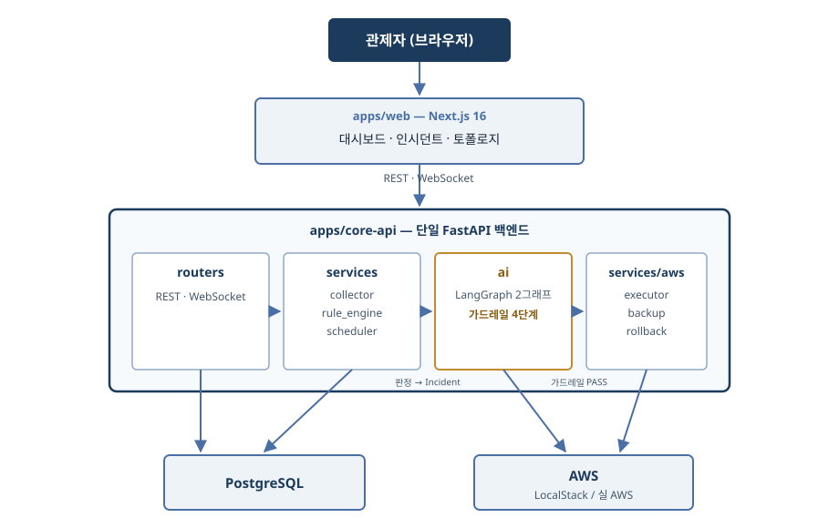
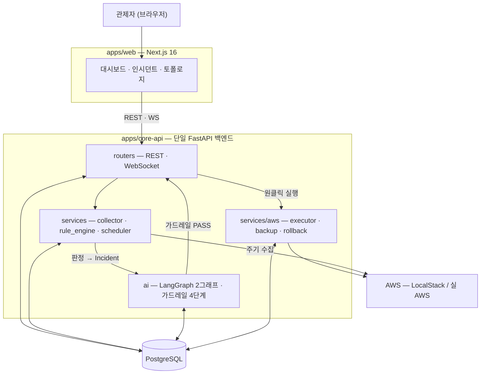

# Vigilantis 프로젝트 기획서

> **상태: 본문 8장 완성 · PM 검토 대기** — 2026-10-01(목) 중간 발표(Connect Day 1일차) 제출용. 이슈 #335.
> 본문의 사실값은 [`docs/PROJECT_STATUS.md`](PROJECT_STATUS.md)(SSOT)를 원천으로 옮겨 적는다. 충돌하면 SSOT가 이긴다.
>
> **출처 표기 규칙** — 각 절 머리에 `> **출처** — …` 한 줄로 그 절의 값이 어디서 왔는지 밝힌다.
> **프로젝트 사실값**(범위·결정·역할·현황·계약)의 원천은 셋뿐이다: **SSOT**(`docs/PROJECT_STATUS.md`) · `docs/adr/` · `packages/schemas/`. 저장소 밖 문서를 프로젝트 사실의 기준으로 삼지 않는다 — 대조할 수 없는 기준은 기준이 아니다.
> **외부 시장·통계**는 다른 축이다. 저장소가 답을 갖고 있지 않으므로 인용하되, **기관명·조사명·연도를 표 아래에 명시**한다.

| 항목 | 값 |
| --- | --- |
| 문서 | 프로젝트 기획서 (중간 발표 제출본) |
| 작성 | 박지현 (Technical Writer) |
| 검토 | 김세혁 (팀장 / PM) |
| 기준일 | 2026-09-16 — SSOT 최종 갱신일 (4인 재편 반영본) |
| 최종 갱신 | 2026-09-17 |
| 직전 제출본 | 2026-09-04(금) 기획 발표 제출본 — WBS가 일정 재편으로 낡아 사실상 재작성 |

<!--
작성 규칙 (#335)
- 기간 표기: `N주차(M/D–M/D)` 형식. 날짜 없는 `N주차` 단독 표기 금지. 범위는 en dash(–).
- 하루를 가리키는 날짜에는 요일: `10/1(목)`.
- 휴일로 구간이 줄면 실작업 일수 병기: `7주차(9/21–9/23 · 실작업 3일)`.
- 인용한 수치·날짜에는 출처를 표기한다.
-->

---

## 1. 개요

### 1.1 한 줄 정의

**Vigilantis는 24/7 AWS 자산·보안 상시 관제 + 4단계 AI 가드레일 기반 원클릭 자율 조치 + 양방향 회복(자동 원복 / 원클릭 해제)을 제공하는 FinSecOps 플랫폼이다.**

"FinSecOps"는 비용 최적화(FinOps)와 보안 대응(SecOps)을 **하나의 조치 파이프라인** 위에 올린다는 뜻이다. 두 축은 탐지 근거와 판단 기준이 다르지만, *탐지 → AI 판단 → 가드레일 검증 → 승인 → 실행 → 회복*이라는 경로를 공유한다.

> **출처** — SSOT §한 줄 요약 (2026-09-16 기준)

### 1.2 문제 정의와 배경

> **출처** — 페르소나는 2026-09-04(금) 기획 발표 제출본 §02·§03, 시장 분석은 같은 제출본 §04에서 옮겼다. 인용 통계의 원출처는 각 표 아래에 밝힌다.

#### 1.2.1 누가 겪는 문제인가 — 인프라가 「다른 영역」인 회사

**개발로 성공해 구색을 갖춘 중소기업**이다. 보유 역량은 **개발에 통달한 전문 개발자** — 그러나 **인프라는 다른 영역**이다.

> **개발 10년차라도, 인프라 구축·유지보수에서는 신입이다.**

그리고 성공이 문제를 만든다.

| | |
| --- | --- |
| **STEP 1** | 바쁜 일정 중 공부해서 **소규모 인프라는 어떻게든** 관리하게 됐다 |
| **STEP 2** | 사업이 성공해 **인프라를 추가로 구성·관리**해야 한다 |
| **STEP 3** | 사장은 **추가 인건비를 쓰고 싶지 않다** |

**STEP 3이 이 프로젝트의 출발점이다.** 인프라가 늘어난 만큼 사람을 늘리는 선택지가 실제로는 닫혀 있다.

#### 1.2.2 왜 전문 인력을 뽑지 않는가 — 조건이 다르다

| 축 | 🏢 대기업 | 🏪 중소기업 |
| --- | --- | --- |
| **자본** | 인프라 투자를 **예산 항목**으로 편성 | **고정비 한 줄이 손익에 그대로** 반영 |
| **인프라 형태** | 온프레미스·하이브리드까지 **직접 운용** | **퍼블릭 클라우드 한 곳**에 의존 |
| **인력** | 안정성 **전담 조직(SRE)을 따로** 둔다 | 전담 없이 **겸업·외주**로 대응 |

**숫자 둘이 그 조건을 보여 준다.**

| | 값 | 뜻 |
| --- | --- | --- |
| 전담 인프라 인력 1명 | **연 6,000만 원** | 5년차 5,000만 + 4대보험·퇴직금 |

> **인용 출처** — 원티드 DevOps 직무 연봉 데이터(2025)

**그리고 전담을 두지 않는 쪽이 다수다.** 정부 조사가 그렇게 보고하지만, **이 기획서는 그 비율을 숫자로 인용하지 않는다** — 공개된 수치는 **보안 담당 인력** 기준(인력 비율)이고 이 절이 말하는 것은 **인프라 담당**(기업 비율)이라 **단위가 다르다.** 원 보고서로 직무 범위·단위·값을 대조하기 전에는 싣지 않는다. **값과 출처가 어긋난 인용은 질문 한 번에 문서 전체의 신뢰를 깎는다.**

**대다수가 고른 답은 「겸업 유지」다** — 사람을 새로 뽑는 대신 **있는 개발자에게 인프라를 얹는다.** 인건비는 그만큼 오르고, 그 개발자는 **인프라에서는 여전히 신입**이다.

> **여러분이 중소기업 사장이라면, 추가 인력을 뽑는 결정을 쉽게 내릴 수 있습니까?**

**그리고 그런 회사가 빠르게 늘고, 그 회사들이 쓰는 클라우드도 함께 커진다.**

| | 값 | 뜻 |
| --- | --- | --- |
| 국내 SaaS 기업 수 | **1,642개** | 2023년 기준 · **전년 대비 +24%** |
| 국내 클라우드 시장 | **99.5억 → 382.8억 달러** | 2025년 → 2031년 전망 (전체 CAGR **25.18%**) |
| **중소기업 세그먼트** | **CAGR 27.2%** | **전체 시장보다 빠르다**(27.2 > 25.18). 근거는 **정부 클라우드 바우처가 도입 장벽을 낮춘 것**이며, 그에 따라 관리형 DevOps 지원 수요가 생긴다 |

> **인용 출처** — 기업 수: 과학기술정보통신부 「2024 클라우드산업 실태조사」 · 시장 규모와 성장률: Mordor Intelligence, 「South Korea Cloud Computing Market Size & Share Analysis — Growth Trends and Forecast (2026–2031)」(2026-01-15 갱신)

**§1.2.1이 그린 회사는 특별한 사례가 아니다.** 그리고 그런 회사는 사업이 커지면 인프라 사용량이 함께 커지는 구조를 갖는다 — **고객사가 늘면 이벤트 처리량이 그대로 인프라 부하가 된다.**

> **인용 출처** — 국내 SaaS·콘텐츠 기업 2곳(고객 메시지 자동화 CRM · 콘텐츠 번역 자동화)의 **AWS 기술 블로그 공개 사례**. 두 회사 모두 사업이 커지면 AWS 인프라 사용량이 함께 늘어나는 구조다.

> **클라우드 사용은 빠르게 늘지만, 그것을 관리할 사람은 늘지 않는다.**

**그래서 이 프로젝트가 풀려는 문제는 「관제를 더 잘하는 법」이 아니라 「관제 인력을 늘리지 않고도 관제가 유지되는 법」이다.**

#### 1.2.3 그렇다면 무엇이 병목인가

클라우드 운영에서 **탐지는 이미 충분히 자동화돼 있다.** 유휴 인스턴스도, 열린 보안 그룹도 도구가 찾아 준다. 병목은 그다음이다.

| 단계 | 현재 | 문제 |
| --- | --- | --- |
| 탐지 | 자동 | — |
| 판단 | **사람** | 알림은 쌓이는데 무엇부터 볼지 근거가 없다 |
| 조치 | **사람** | 콘솔·CLI를 직접 친다. 야간·휴일에는 지연이 그대로 노출 시간이 된다 |
| 회복 | **사람** | 조치가 틀렸을 때 되돌릴 근거가 조치자의 기억에 있다 |

**겸업 담당자에게는 이 세 단계가 특히 비싸다.** 본업이 따로 있어 알림을 제때 못 보고, 인프라가 주 전공이 아니라 판단에 시간이 더 걸리며, 되돌리는 절차는 평소에 쓰지 않아 몸에 배어 있지 않다.

#### 1.2.4 자동화를 막는 것은 성능이 아니라 신뢰다

그래서 **조치를 자동화하자**는 결론은 쉽게 나온다. 그런데 자동화가 실제로 막히는 이유는 성능이 아니라 **신뢰**다.

1. **되돌릴 수 없는 조치를 기계가 한다** — 인스턴스를 격리하거나 보안 그룹을 지우는 일은 취소 버튼이 없다.
2. **LLM이 무엇을 할지 자유롭게 정한다** — 자연어 판단을 그대로 실행에 연결하면, 잘못된 대상·잘못된 작업이 통과하는 경로가 열린다.
3. **실패했을 때 되돌릴 근거가 남지 않는다** — 조치 전 상태를 어디에도 적어 두지 않으면 원복은 사람의 기억에 의존한다.

**Vigilantis의 전제는 "AI에게 실행 권한을 주되, AI가 통과할 수 있는 문을 좁힌다"이다.**

- AI는 **무엇을 할지 고르지 않는다.** 미리 등재된 **런북 10종** 중에서 **고른다**(Action Whitelist).
- 고른 결과는 실행 전에 **4단계 가드레일**(Schema Check → Action Whitelist → ARN Match → AWS Dry-Run)을 순서대로 통과해야 한다.
- 조치 **전에** 원래 상태를 백업 레코드로 남긴다. 원복 파라미터는 AI도 화면도 아닌 **그 레코드에서만** 온다.
- 실패하면 **시스템이 스스로 되돌리고**(자동 원복), 보안 차단은 관제자가 **원클릭으로 해제**한다(양방향 회복).

**이 넷이 §1.2.2의 답이다** — 사람을 늘리지 않고 관제를 유지하려면 조치까지 자동이어야 하고, 조치가 자동이려면 **되돌릴 수 있어야** 한다.

### 1.3 목표와 비목표

#### 목표 (MVP · 2026-10-01(목) 중간 발표 시연 범위)

| # | 목표 | 확인 방법 | 현재(2026-09-17) |
| --- | --- | --- | --- |
| 1 | AWS 단일 계정 / 1–2개 리전의 자산·보안 상태를 주기 수집해 판정한다 | Golden Dataset 판정 정답 대조 | ✅ 동작 |
| 2 | 판정 결과를 AI가 읽고 **CoT 3줄 요약 + 런북 추천**을 낸다 | AI 산출 정답지 회귀 | ✅ 동작 |
| 3 | 추천이 **4단계 가드레일**을 순서대로 통과해야 승인 대기로 올라간다 | 가드레일 단계별 기록 | ✅ 동작 |
| 4 | 관제자가 **원클릭으로 실행**하고 결과가 AWS에 실제로 반영된다 | E2E 시나리오 T1·T2 | ✅ 경로 실측 · **회귀 테스트 통과**(§4.2 · 2026-09-17) |
| 5 | 실패 시 **자동 원복**, 보안 차단은 **원클릭 해제**로 되돌린다 | E2E 시나리오 T1·T2 | ✅ T2 관통 실측(9/15) · T1 주입 가능 판정(9/16) · **회귀 테스트 2건 통과**(9/17) |
| 6 | 조치별 **절감 예상 금액과 그 산출 근거**를 함께 제시한다 | 저장된 근거 필드 조회 | 🔶 **금액·근거 생성·저장·조회 v1 머지**(2026-09-17 · PR #361) — 화면 표시까지의 잔여는 #356 |

> **「확인 방법」과 「현재」를 갈라 적는 이유** — 확인 방법만 적으면 *이미 확인됐다* 로 읽힌다. 6주차(9/14–9/18) 시점에 무엇이 서 있고 무엇이 남았는지를 함께 적는 편이, 시연 당일 질문에 문서가 먼저 답을 갖고 있게 한다.

> **출처** — SSOT §MVP 확정 범위

#### 비목표 (이번 범위 밖)

**빠진 것이 아니라 뺀 것이다.** 각 항목은 확정 결정으로 범위 밖에 두었다.

| 범위 밖 | 사유 | 언제 |
| --- | --- | --- |
| 실환경 GuardDuty 연동 | MVP는 Golden Dataset 기반 **모의(Mock) 주입**으로 위협을 넣는다 | Post-MVP |
| 비용 추이 그래프 · 누적 절감 캘큘레이터 | 절감 예상은 **개별 추천 하나**에 한한다. 집계·추이 축은 별개 기능이다 (2026-09-07 확정) | Post-MVP |
| 근거 조회 · 시계열 차트 · 시간 슬라이드 차트 | 2026-09-03 회의에서 현 마일스톤 카드에서 제외 | 추후 |
| 다중 계정 / 전 리전 관제 | 단일 계정 · 1–2개 리전으로 고정 | Post-MVP |

> **출처** — SSOT §MVP 확정 범위 — 「이번 범위 밖」 항목과 §확정 결정 로그

### 1.4 성과지표 — 무엇으로 「됐다」고 판정하는가

> **출처** — 지표값은 저장소 실측(2026-09-17 재측정) · SSOT §MVP 확정 범위 · `CLAUDE.md` §PR 규칙

**§1.3의 목표가 「무엇을 만드나」라면, 성과지표는 「무엇으로 됐다고 판정하나」다.** 아래 지표는 전부 **저장소에서 명령으로 다시 잴 수 있는 값**이며, 재는 법을 함께 적는다. **재는 법이 적혀 있지 않은 지표는 아무도 재지 않는다.**

#### ① 정확성 — 판단이 정답과 일치하는가

| 지표 | 목표 | 현재(2026-09-17) | 재는 법 |
| --- | --- | --- | --- |
| 자산 판정 정답 일치율 | **100%** | ✅ **28/28** | `scripts/load_golden_assets.py --verify` |
| 위협 판정 정답 일치율 | **100%** | ✅ **16/16** | SecOps 골든 회귀 |
| 골든 커버리지 | 자산 유형 **7/7종** · 관계 **6/6종** | ✅ 전부 | 커버리지 가드(pytest) |
| Skip 사유 코드 커버리지 | **6/6종** | ✅ 전부 | 골든 회귀 |
| AI 출력 안정성 | **실행으로 나가는 값의 흔들림 0** — `runbook_id` · `target_arn` · `evidence_ids` · 후보 개수 | ✅ | AI 산출 정답지 **6건** 회귀 |

> **AI 출력 지표를 「실행으로 나가는 값」으로 좁힌 이유** — 요약 문장은 표현이 흔들려도 조치가 달라지지 않지만, 위 네 값이 흔들리면 **다른 자원에 다른 조치가 나간다.** 금액 같은 표시값은 이 합격선 밖이며 별도로 잰다.

#### ② 안전성 — 되돌릴 수 없는 조치를 막는가

| 지표 | 목표 | 현재(2026-09-17) | 재는 법 |
| --- | --- | --- | --- |
| Whitelist 밖 Runbook의 실행 진입 | **0건** | ✅ 구조상 차단 | 가드레일 ② 단계 기록 |
| 가드레일 4단계 실행 순서 | **고정 · 건너뛰기 0건** | ✅ | `guardrail_evaluations` 행 |
| 조치 : 백업 레코드 | **원복 짝이 있는 런북 4쌍에서 1 : 1** — 조치 *전에* 1회 캡처, 불변 | ✅ | ADR-0008 · `backup_record_id` |
| 원복 파라미터 출처 | **DB 백업 레코드 100%** — AI·화면 경유 0건 | ✅ | ADR-0004 롤백 정책 ③ |
| 자동 원복 발동 | Status Check **2/2 실패 시 100%** | ✅ **실패 주입 가능 판정**(2026-09-16) · **회귀 통과**(2026-09-17) | E2E T1 |

> **백업이 답하지 않는 2종이 있다.** `ENABLE_AUTOSCALING`·`EBS_DELETE_UNATTACHED`에는 백업 레코드도 롤백 런북도 없다(ADR-0008 §5의 백업 4종은 원복 짝이 있는 4쌍에만 붙는다). **그래서 이 둘은 자동 발동 경로 없이 관제자 승인 뒤에만 실행된다**(SSOT §Action Whitelist). 되돌릴 수 없는 조치를 기계가 스스로 시작하지 않는다는 뜻이다.

#### ③ 시연·운영 — 발표 자리에서 성립하는가

| 지표 | 목표 | 현재(2026-09-17) | 재는 법 |
| --- | --- | --- | --- |
| 시연 소요 시간 | **T1 + T2 ≤ 8분** | 🔶 T1-3–6 구간 **60–90초** · T2 후반 미측정 — 값의 출처인 9/11 게이트 판정서는 삭제돼 git 이력(`git show 60f329f:docs/E2E_GATE_0911.md` §5-4)에만 있다 | **9/29(화)–9/30(수) 리허설 실측** |
| 사람 조작 횟수 | T1 **「조치 실행」 1회** · T2 **승인 2회** | ✅ T2 관통 실측(2026-09-15) | E2E 시나리오 |
| CI 필수 체크 | **3잡 전부 통과** | ✅ `dev` **2133 passed / 0 skipped** (2026-09-17 기준) | GitHub Actions |
| 전 구간 흐름 회귀 | **T1 · T2 2건 통과** | ✅ **2건 통과** — 2026-09-17 dev 머지 (`apps/core-api/tests/test_e2e_flow.py`) | `pytest` |

> **기준선은 낡는다.** 위 CI 수치는 **2026-09-17 기준**(`dev`)이고 매 머지마다 움직인다. 비교할 때는 **같은 자리에서 다시 잰다.**

---

## 2. 해결방안 — 서비스 범위와 차별성

> **출처** — SSOT §MVP 확정 범위 · §Action Whitelist 표

### 2.1 핵심 3축

§1.2의 전제 — *AI에게 실행 권한을 주되 통과할 문을 좁힌다* — 를 세 축으로 구현한다.

| 축 | 무엇을 하나 | 이 축이 지키는 것 |
| --- | --- | --- |
| ① 상시 관제 | 자산·보안 상태를 주기 수집해 판정한다 | 판단의 **근거**가 사람 기억이 아닌 데이터에 있다 |
| ② 4단계 가드레일 | AI 추천을 실행 전에 순서대로 검증한다 | AI가 **고를 수 있는 범위**를 좁힌다 |
| ③ 양방향 회복 | 조치를 되돌리는 경로를 미리 만들어 둔다 | 되돌릴 **근거**가 조치 전에 남는다 |

#### 축 ① 상시 관제 — 무엇을 보고 무엇으로 판정하나

| 항목 | 범위 |
| --- | --- |
| 계정 · 리전 | AWS **단일 계정 / 1–2개 리전** |
| 관제 대상 | **EC2 · SG 중심** + 런북 조치 대상 리소스(NACL, EBS, ASG · Launch Template, ALB Target Group) |
| 위협 유형 | **OpenIP** (`0.0.0.0/0`) · **SSH 브루트포스** 2종 — Golden Dataset 기반 **모의(Mock) 주입** |
| 수집 주기 | APScheduler 기반 주기 스캔 |

**3단계 위험 대응** — 위험도에 따라 사람이 개입하는 지점이 달라진다.

| 위험도 | 처분 | 사람의 개입 | 현재(2026-09-17) |
| --- | --- | --- | --- |
| High | `PRE_MITIGATION_0_5S` — 0.5초 선차단 | 차단 **후** 확인 | 🔶 **설계 확정 · 발동은 아직이다** — 이 경로로 실행되는 런북은 `RUNBOOK_EC2_ISOLATE` 하나이고 P2라 실 AWS 첫 검증이 10주차(10/12–10/15)다 |
| Medium | `AGENT_WAIT` — 승인 대기 · 1분 미응답 시 자동 격리 (`TIMEOUT_ISOLATION_1M`) | 승인 | 🔶 **설계 확정 · 발동 잡 없음** — dev에는 기한 시각을 기록하는 코드(`response_deadline_at`)만 있고, 기한이 지났을 때 격리를 발동하는 잡이 없다(SSOT §미해결 6번) |
| Low | `AGENT_WAIT` — 승인 대기 (**자동 격리 없음**) | 승인 | ✅ 동작 |

> **10/1(목) 시연에서 보이는 것은 Low·Medium의 「승인 대기 → 관제자 승인」까지다.** 위 두 자동 경로는 설계로 확정돼 있고 계약·화면까지 서 있지만, **발동 주체가 아직 없어 시연 대본(§4.2)에 들어가지 않는다.**

> **화면 표기**: Medium 대기 화면에는 **초 단위 카운트다운을 두지 않는다.** `제안 생성 시간` · `실행 예정 시간` **절대 시각 2종**만 보여준다(2026-08-27 확정).

#### 축 ② 4단계 가드레일 — AI가 통과해야 하는 문

**순서가 고정돼 있다.** 앞 단계를 건너뛰는 경로는 없다.

| # | 단계 | 무엇을 검사하나 | 여기서 막히는 것 |
| --- | --- | --- | --- |
| ① | Schema Check | AI 출력이 Pydantic v2 계약을 만족하는가 | 형식이 깨진 출력 |
| ② | Action Whitelist | `Runbook ID`가 등재된 10종 안에 있는가 | **표에 없는 조치** — AI가 새 작업을 지어내는 경로 |
| ③ | ARN Match | 조치 대상 ARN이 수집된 자산과 일치하는가 | 존재하지 않거나 **엉뚱한 대상** |
| ④ | AWS Dry-Run | 실제 AWS가 이 호출을 받아들이는가 | 권한·파라미터 오류 |

> ⚠️ **④ Dry-Run 통과는 대상 자원의 존재를 증명하지 않는다** — 부재 자원에도 `DryRunOperation`이 돌아온다(ADR-0007 1차 개정 · 2026-08-25 실측). 대상 존재는 ③이 책임진다. **Dry-Run 미지원 런북 5종은 조회로 대체 검증**한다(ADR-0007 §4).

#### 축 ③ 양방향 회복 — 되돌리는 두 경로

| 축 | 경로 | 발동 주체 |
| --- | --- | --- |
| 자산 (FinOps) | 스펙 JSON 백업 ➔ `get_waiter` **Status Check 2/2** ➔ 실패 시 **자동 원복** | **시스템** |
| 보안 (SecOps) | 선제 차단 ➔ 관제자 **「원클릭 해제」** | **관제자** |

**원복 파라미터는 AI도 화면도 아닌 DB 백업 레코드에서만 온다** (`backup_record_id`). 조치 *전에* 남긴 값이므로, 조치 후 상태가 무엇이든 되돌릴 근거가 보존된다.

> **레콘(Reckon)** — 가드레일이 *실행해도 되는가*를 묻는다면, 그 다음 두 물음 *실제로 무엇이 일어났는가* → *그 결과를 어떻게 수습·종료하는가* 를 다루는 **Incident 상태와 그 상태를 관리하는 일련의 과정**을 부르는 고유명사다. '가드레일'과 같은 층위로 쓴다(2026-09-03 확정).

#### AI 계층

| 항목 | 값 |
| --- | --- |
| 모델 | OpenAI `gpt-5.6-luna` (`reasoning_effort=low`) |
| 출력 계약 | Pydantic v2 **Structured Output** |
| 오케스트레이션 | **LangGraph** — 프로젝트 정체성으로 MVP 구현 확정(2026-08-13) |
| 산출 | **CoT 3줄 요약 + Runbook ID 추천** |
| 조치별 절감 예상 | **AI는 단가를 추정하고, 금액·조건 설명은 서버가 계산한다** — 대상은 **가드레일을 통과한 `RIGHTSIZING` 후보**에 한한다(2026-09-17 PM 리뷰 · PR #361). 결과는 구조화 필드로 **저장해 두고 재사용**하며 볼 때마다 다시 부르지 않는다(2026-09-07 확정) |

### 2.2 Action Whitelist — 런북 10종 (본편 7 + 롤백 3)

**여기 없는 Runbook ID는 실행 경로에 진입할 수 없다**(가드레일 ②). 이 표가 확정본이며, 코드와 어긋나면 표를 기준으로 코드를 고친다.

| 분류 | Runbook ID | 위험도 / 승인 | AI 추천 | 등록 롤백 |
| --- | --- | --- | --- | --- |
| SecOps | `RUNBOOK_EC2_ISOLATE` | High / 0.5초 선차단 · 1분 타임아웃 | ✅ | `RUNBOOK_EC2_UNISOLATE` |
| SecOps | `RUNBOOK_NACL_ADD_DENY` | Medium / 관제자 승인 | ✅ | — (해제는 `NACL_RESTORE` 주 조치 경로) |
| SecOps | `RUNBOOK_NACL_RESTORE` | Low / 관제자 승인 (원클릭 해제) | ✅ | — |
| SecOps | `RUNBOOK_SG_DELETE_ISOLATED` | Medium / 관제자 승인 | ✅ | `RUNBOOK_SG_RECREATE` |
| FinOps | `RUNBOOK_EC2_RIGHTSIZING` | Medium / 관제자 승인 (자동 원복 시연 대상) | ✅ | `RUNBOOK_EC2_REVERT_SIZE` |
| FinOps | `RUNBOOK_EC2_ENABLE_AUTOSCALING` | Medium / 관제자 승인 (stateless 한정 구조 전환) | ✅ | — |
| FinOps | `RUNBOOK_EBS_DELETE_UNATTACHED` | Low / 관제자 승인 | ✅ | — |
| 롤백 | `RUNBOOK_EC2_UNISOLATE` | Medium / 관제자 승인 (원클릭 해제) | ❌ | — |
| 롤백 | `RUNBOOK_SG_RECREATE` | Low / 관제자 승인 | ❌ | — |
| 롤백 | `RUNBOOK_EC2_REVERT_SIZE` | High / **시스템 자동 발동**(Status Check 실패 시) 또는 관제자 수동 요청 | ❌ | — |

> **분류 축 주의**: 위 `분류`는 Runbook Registry 축(`FINOPS` · `SECOPS` · `ROLLBACK`)이며 **Incident 분류와 별개**다 (`FINOPS` · `SECOPS`). 롤백 3종은 Registry에서 `ROLLBACK` 단일 도메인으로 묶인다.

**롤백 런북 공통 정책** (2026-08-13 확정 · [ADR-0004](adr/0004-rollback-runbook-whitelist-registration.md))

1. **Whitelist 정식 등록** — 롤백이라고 가드레일을 우회하지 않는다. 우회 경로 자체가 없다.
2. `ai_recommendable: false` — **AI 추천 목록에서 제외.** 트리거는 **시스템 또는 관제자**만이다.
3. **원복 파라미터는 DB 백업 레코드에서만 로드** — AI 출력도 화면 입력도 원복 값의 출처가 될 수 없다.
4. **롤백이 가드레일에서 거절되면 자동 재시도 없이 CRITICAL 알림 + 수동 개입** — 되돌리기 실패를 조용히 삼키지 않는다.

### 2.3 범위 경계

기능 축의 비목표는 §1.3에 적었다. 여기서는 **MVP 안에서의 경계**를 못 박는다.

| 축 | MVP 경계 | 넘어가면 |
| --- | --- | --- |
| 계정 · 리전 | 단일 계정 / 1–2개 리전 | Post-MVP |
| 위협 입력 | Golden Dataset 기반 **모의 주입** 2종 | 실환경 GuardDuty 연동 = Post-MVP |
| 조치 | **등재된 10종만** | 런북 추가는 ADR로 등재해야 한다(ADR-0002 · ADR-0004) |
| 절감 예상 | **개별 추천 하나**의 금액과 근거 | 집계 · 추이 축 = Post-MVP |
| 시연 환경 | **LocalStack**(2026-10-01(목) 중간 발표) — 사유는 §4.4 | 실 AWS 스모크 = 9주차(10/02–10/08) |

**최종 발표 2026-12-11(금)에 Post-MVP 범위까지 배포·시연한다.** 그 범위는 중간 발표 뒤에 확정한다.

### 2.4 해결방안의 차별성 — 「탐지 다음」을 다르게 잡았다

클라우드 비용 최적화 도구도, 보안 탐지 도구도 이미 많다. **탐지는 경쟁 지점이 아니다.** 이 프로젝트가 다르게 잡은 것은 **그다음 — 판단·조치·회복**이다(§1.2).

#### 이미 있는 서비스는 어디서 멈추는가

> **출처** — 2026-09-04(금) 기획 발표 제출본 §05

대표적인 것이 **AWS GuardDuty + Security Hub**다. 계정·네트워크 로그를 분석해 위협을 탐지하고 보안 기준 위반을 점수로 모아 보여 주는 AWS 기본 서비스이며, **에이전트 없이 켜기만 하면 되고 사용량 기반 과금이라 시작 부담이 작다.** 잘하는 도구다.

**멈추는 지점이 분명하다.**

| | |
| --- | --- |
| **결과물** | **탐지 결과와 점수**까지다. **어떤 자산을 어떻게 고칠지는 콘솔에서 사람이 판단하고 실행한다** |
| **중소기업 관점** | 알림은 쌓이는데 **읽고 조치할 담당자가 없어 대시보드가 방치된다** |

**기존 도구들의 공통점 둘.**

1. **탐지·가시성까지는 이미 잘 풀려 있다** — 여기서 경쟁하지 않는다.
2. **실행·원복은 사람 몫으로 남는다** — §1.2.2에서 본 대로, 그 사람이 없는 것이 문제였다.

> **빈 자리** — **경고를 「안전하게 실행까지」 끌고 가는 도구가 아직 없다.** 이 프로젝트가 서는 자리다.

#### 무엇을 다르게 했는가

| | 일반적인 접근 | Vigilantis |
| --- | --- | --- |
| 탐지 후 | **권고까지.** 조치는 사람이 콘솔에서 | **조치까지.** 단 등재된 10종 안에서만 |
| AI의 역할 | 무엇을 할지 **자유롭게 제안** | **고르기만 한다** — Action Whitelist 밖으로 못 나간다 |
| 실행 전 검증 | 권한·파라미터 확인 정도 | **순서 고정 4단계.** 대상 존재는 ARN Match가, 호출 가능 여부는 Dry-Run이 본다 |
| 실패했을 때 | 사람이 수습 | **자동 원복**(자산) · **원클릭 해제**(보안) |
| 되돌릴 근거 | 조치자의 기억·로그 | **조치 *전에* 만든 백업 레코드** — 원복 파라미터의 유일한 출처 |
| 비용·보안 | 서로 다른 도구·다른 화면 | **한 조치 파이프라인** 위 |

#### 독창적인 것 셋

**① AI에게 「만들라」가 아니라 「고르라」고 한다.**
자연어 판단을 그대로 실행에 잇는 대신, **미리 등재한 런북 10종 중에서 고르게** 한다. AI가 새 작업을 지어내는 경로가 **구조적으로 없다**(가드레일 ②). 흔한 접근은 LLM에게 스크립트나 IaC를 생성시키는 것인데, 그러면 *무엇이 실행될 수 있는가* 의 상한이 사라진다.

**② 되돌릴 근거를 조치 *전에* 만든다.**
원복 파라미터의 출처를 **DB 백업 레코드 하나로 못 박았다**(ADR-0004 ③ · ADR-0008). AI 출력도, 화면 입력도 원복 값이 될 수 없다. 조치 후 상태가 무엇이든 되돌릴 근거가 남는다 — **자동화의 전제가 성능이 아니라 회복 가능성**이라는 판단이다.

**③ 롤백도 같은 문을 지나게 했다.**
롤백 런북 3종을 **Whitelist에 정식 등록**해(ADR-0004) 우회 경로를 만들지 않았다. *되돌리기만 검증 없이 도는* 구멍을 열지 않기 위해서다 — 우회로를 뚫는 쪽이 구현은 쉽지만, 그 순간 **가장 위험한 조치가 가장 덜 검증된다.**

#### 왜 이 조합이 흔치 않은가

세 요소는 각각 새롭지 않다. **셋이 함께 서야 자동화가 성립한다는 것**이 이 프로젝트의 주장이다.

- 화이트리스트만 있으면 — 실행은 막지만 **실패했을 때 되돌릴 수 없다.**
- 백업만 있으면 — 되돌릴 수는 있지만 **애초에 엉뚱한 조치가 나간다.**
- 자동 원복만 있으면 — 되돌리는 동작 자체가 **검증 없이 돈다.**

그래서 §1.2의 신뢰 3가지에 **각각 구조를 하나씩** 대응시켰다(대응표는 §3.3).

---

## 3. 시스템 아키텍처

### 3.1 구성도

> **출처** — ADR-0001(단일 FastAPI 백엔드·모노레포) · SSOT §MVP 확정 범위 아키텍처 절

<!--
구성도 원본(mermaid). 위 SVG는 이 그래프를 손으로 옮긴 것이다 —
Confluence·Word 어디서도 mermaid가 렌더되지 않아 이미지를 본문에 둔다.
구조가 바뀌면 아래를 고치고 docs/img/architecture.svg 를 함께 고친다.

-->

**조치 한 건이 지나는 경로는 하나다.**

`주기 수집` → `규칙 판정` → `Incident 생성` → `AI 요약·런북 추천` → `가드레일 4단계` → `관제자 승인` → `실행` → `회복(자동 원복 / 원클릭 해제)`

### 3.2 기술 스택

> **출처** — SSOT §MVP 확정 범위 · ADR-0001 · ADR-0003 · ADR-0005 · ADR-0006

| 층 | 채택 | 근거 |
| --- | --- | --- |
| **백엔드** | **단일 FastAPI** (`apps/core-api`) | ADR-0001 |
| DB | PostgreSQL + Alembic | ADR-0001 |
| 스케줄러 | APScheduler (앱 `lifespan` 배선 · advisory lock으로 중복 실행 방지) | SSOT |
| **프론트엔드** | **Next.js 16**(App Router · Turbopack) + React 19 + TypeScript + **Tailwind CSS v4** + shadcn UI | ADR-0003 |
| **AI 모델** | OpenAI `gpt-5.6-luna` (`reasoning_effort=low`) | SSOT |
| AI 출력 계약 | **Pydantic v2 Structured Output** | SSOT |
| AI 오케스트레이션 | **LangGraph** — 도메인별 2그래프 | ADR-0005 |
| AWS 제어 | boto3 (`AWS_ENDPOINT_URL` 스위치 하나로 LocalStack ↔ 실 AWS) | ADR-0006 |
| **개발·시연 환경** | **LocalStack**(단일 compose · 버전 고정 · Boto3 시드 단일 원천) | ADR-0006 |
| 공통 스키마 | `packages/schemas` — FE↔BE 계약의 코드 원천 | ADR-0001 |
| 테스트 | pytest(BE) · `node --test`(FE) | — |
| CI | GitHub Actions **3잡** — `test` · `web` · `ai-signature` | SSOT |

### 3.3 주요 설계 결정 (ADR)

**이 프로젝트는 설계 결정을 문서로 남긴다.** 9건이 저장소 [`docs/adr/`](adr/)에 있고, 각 ADR은 *무엇을 정했나* 와 *무엇을 버렸나* 를 함께 적는다. 아래는 그 요약이며, 배경·대안 비교·개정 이력은 원문에 있다.

| ADR | 날짜 | 결정 | 이 결정이 막는 것 |
| --- | --- | --- | --- |
| [0001](adr/0001-mvp-monorepo-structure.md) | 2026-08-11 | **MVP는 단일 FastAPI 백엔드로 통합한다** — 앱 4개(마이크로서비스) 구조를 `apps/core-api` 하나로 | 단일 계정·1–2개 리전 범위에 Step Functions·Lambda를 얹어 **서비스 간 배포·통신 비용이 개발 속도를 먹는 것** |
| [0002](adr/0002-runbook-whitelist-mvp-scope.md) | 2026-08-12 | **Action Whitelist를 레지스트리 7종으로 확정**하고 전부 MVP 범위로 (→ 0004로 10종) | 조치 범위가 *예시* 로만 남아 **AI 엔진과 Boto3 제어가 서로 다른 목록을 보고 개발되는 것** |
| [0003](adr/0003-fe-stack-nextjs-16.md) | 2026-08-13 | **FE 스택을 Next.js 16 + React 19 + Tailwind v4 + shadcn 4로** | 동결된 Next 14 라인 위에서 **컴포넌트를 추가할 때마다 수동 구성 부담**을 지는 것 |
| [0004](adr/0004-rollback-runbook-whitelist-registration.md) | 2026-08-13 | **롤백 3종도 Whitelist에 정식 등록한다(7→10종)** — 우회 경로를 만들지 않는다 | **가드레일이 우리 자신의 자동 원복을 차단**하는 것. 우회로를 뚫었다면 *되돌리기* 만 검증 없이 도는 구멍이 생긴다 |
| [0005](adr/0005-langgraph-stateless-domain-graphs.md) | 2026-08-18 | **LangGraph를 상태 없는 도메인별 두 그래프로** — 상태 원천은 그래프가 아니라 **DB** | 그래프 Checkpointer가 **제2의 상태 원천**이 되어, AWS를 실제로 바꾼 뒤 *무엇이 근거였나* 를 사후에 설명할 수 없게 되는 것 |
| [0006](adr/0006-localstack-team-standard-env.md) | 2026-08-19 | **LocalStack을 팀 표준 환경으로** — 단일 compose · 시드 단일 원천 · `AWS_ENDPOINT_URL` 스위치 | 통합 테스트가 **개인 PC에서만 통과**하고 CI에서는 조용히 전부 skip되는 것 |
| [0007](adr/0007-guardrail-dryrun-executor-precheck-contract.md) | 2026-08-24 | **가드레일 ④는 executor의 단일 호출로 판정한다** (`precheck()`) — Dry-Run 미지원 작업은 **조회로 대체 검증** | 가드레일(AI 소유)과 executor(Infra 소유)의 **경계에 규약이 없어 양쪽이 서로를 기다리는 것** |
| [0008](adr/0008-backup-record-lifecycle-recovery-integrity.md) | 2026-09-02 | **백업은 조치 직전 1회 캡처·불변 보존**하고, **원복 재개는 시간이 아니라 상태 대조로** 판단한다 | 원복의 유일한 근거가 *어디서 읽는가* 만 정해지고 **언제 만들고 무엇과 대조하는가가 빈 채로** 자동 원복이 붙는 것 |
| [0009](adr/0009-real-aws-smoke-environment.md) | 2026-09-15 | **실 AWS 스모크 환경을 격리된 전용 VPC·전용 키·비용 통제로 세운다** — 인터넷 게이트웨이 없는 VPC, 코드가 부르는 AWS 작업만 허용된 키, Boto3 스크립트 하나로 구성·정리 | 스모크가 **PM 개인 계정의 관리자 키로** 돌아 실수 한 번이 실 자원·실 과금으로 번지는 것. 그리고 P2 3종의 유일한 검증 경로가 **10/1(목) 뒤에야 준비되기 시작하는 것** |

**세 ADR이 §1.2의 「신뢰」 3가지에 그대로 대응한다.**

| §1.2의 위험 | 답 |
| --- | --- |
| 되돌릴 수 없는 조치를 기계가 한다 | **ADR-0008** — 조치 *전에* 백업을 남기고 불변으로 보존 |
| LLM이 무엇을 할지 자유롭게 정한다 | **ADR-0002 · 0004** — 등재된 10종 밖으로 나갈 경로가 없다 |
| 실패했을 때 되돌릴 근거가 없다 | **ADR-0004 ③ · 0008** — 원복 파라미터는 **DB 백업 레코드에서만** 온다 |

> **ADR은 살아 있는 문서다.** 0002·0004·0006·0007은 실측이 쌓이며 개정됐고(0006은 6차까지), **개정 이력이 본문 하단에 남는다.** 핵심 결정은 불변이고 바뀐 것은 대상 목록·검증 한계·좌표다.

### 3.4 API 계약 개요

> **출처** — SSOT §API 계약 (코드 원천: packages/schemas/api/)

**FE↔BE 공개 계약은 코드가 원천**(`packages/schemas/api/`)이고 문서는 그 요약이다.

| 엔드포인트 | 담는 것 |
| --- | --- |
| `GET /api/v1/assets` | EC2/SG 상태·스펙·연결관계 · 헬스 스코어(**0–100 정수**) · Skip 사유 코드 **6종** |
| `GET /api/v1/incidents` | 목록 — 상세의 부분집합 10필드. `status`·`category` 필터, `created_at` 내림차순 |
| `GET /api/v1/incidents/{id}` | **AI CoT 3줄 요약** · Evidence ID · 추천 런북(**본편 7종만**) · 실행 요약(복구 조치는 **롤백 3종만**) |
| `POST /api/v1/actions/execute` | Request는 **셋뿐**이다 — `{incident_id, runbook_id, idempotency_key}` — 신규 `202`, 같은 키 재요청 `200`(멱등 재생) |
| `WebSocket /api/v1/ws` | `INCIDENT_CREATED` · `INCIDENT_UPDATED` · `EXECUTION_UPDATED` — **DB commit 이후 전송, 상태 원본이 아니다** |

**계약이 지키는 두 가지가 §1.2의 전제와 이어진다.**

1. **실행 요청은 Target ARN도 AWS 파라미터도 받지 않는다.** 무엇을 어디에 할지는 서버가 Incident와 백업 레코드에서 정한다 — 화면이 조작돼도 조치 대상이 바뀌지 않는다.
2. **화면 표시용 값은 서버가 typed 파라미터에서 파생한다** (`display_parameters` ← `parameters`). LLM이 짓지 않고, 실행 요청으로 되돌려 받지도 않는다.

실행 상태는 **7종**이다 — `IN_PROGRESS` · `SUCCESS` · `FAILED` · `ROLLBACK_INITIATED` · `ROLLED_BACK` · `ROLLBACK_FAILED` · `UNVERIFIED`(AWS 조회 실패로 결과를 판정하지 못한 종료 상태 — 자동 원복하지 않고 관제자 복구를 연다).

---

## 4. 검증 전략

**"돌더라"가 아니라 "무엇과 대조해 맞다고 하는가"를 정해 두는 것**이 이 장의 내용이다. 세 층으로 잰다 — **정답지**(Golden Dataset) · **경로**(E2E 시나리오) · **회귀**(CI).

### 4.1 Golden Dataset — 판정의 정답지

> **출처** — SSOT §MVP 확정 범위 Golden Dataset 현재값(2026-09-14 실측 · 이슈 #310)
<!--
아래 수치는 2026-09-16에 저장소에서 직접 다시 셌다.
-->

**⚠️ 총계를 한 숫자로 적지 않는다 — 답이 셋이고 뜻이 다르다.**

| 축 | 건수 | 무엇인가 |
| --- | --- | --- |
| 입력 자산 | **32건** | 골든이 DB에 적재하는 자산(`datasets/golden/finops/input/`) |
| **판정 정답** | **28건** | 규칙 엔진 판정의 정답이 있는 자산. `--verify`가 대조하는 수 |
| SecOps 이벤트 | **16건** | 입력 16 / 정답 16 |

**32와 28의 차이 4건은 누락이 아니다.** 그래프 노드로만 쓰이고 **판정 대상이 아닌** 토폴로지 전용 유형이다 — `NACL` · `LAUNCH_TEMPLATE` · `AUTO_SCALING_GROUP` · `ALB_TARGET_GROUP` **각 1건**(2026-09-16 실측).

**골든이 덮는 범위**

- 자산 유형 **7/7종** · 관계 **6/6종** — 토폴로지 그래프가 그릴 노드와 엣지가 전부 선다
- 판정 결과 `verdict` **4종** · Skip 사유 코드 **6종** 전량
- AI 산출 정답지 **6건** — 골든이 **그래프 출력 계약에 처음으로 닿는 자리**다

**정답지를 지키는 가드 둘.** 정답지는 만들어 두면 낡는다. 그래서 정답지 자체를 회귀로 잠근다.

| 가드 | 무엇을 막나 |
| --- | --- |
| **스키마 드리프트 가드** | 골든 추출 스키마와 Pydantic 계약이 갈리는 것을 **등식**으로 잠근다 — 부분집합 비교는 항상 참이라 하는 일이 없다 |
| **커버리지 가드** | 판정 대상 유형에 정답이 빠지는 것 |

### 4.2 E2E 시연 시나리오 (T1 · T2)

> **출처** — docs/E2E_DEMO_SCENARIOS.md

시연 경로는 **두 트랙**이고, 각 단계가 `실패 시 대체 컷`과 짝을 이룬다. 대본은 [`docs/E2E_DEMO_SCENARIOS.md`](E2E_DEMO_SCENARIOS.md)에 있고, `tests/test_e2e_scenario.py`가 그 대본의 명세다.

| 트랙 | 시나리오 | 단계 | 증명하는 것 |
| --- | --- | --- | --- |
| **T1 · FinOps** | Idle EC2 다운사이징 → **자동 원복** | 9단계 | **「조치 실행」 이후 사람 입력이 없다.** 실패 판정·원복 발동·자식 실행 접수까지 전부 시스템이 한다 |
| **T2 · SecOps** | SSH 브루트포스 → 차단 → **원클릭 해제** | 8단계 | 사람 조작이 **승인 2회뿐**이다. 해제 근거는 차단 시점의 백업 레코드에서 온다 |

**T1의 함정 하나** — 7번 시점에 Execution은 `ROLLBACK_INITIATED`인데 Incident는 `FAILED`가 아니라 `ACTION_IN_PROGRESS`다. **되돌릴 것이 남아 있기 때문**이며, 두 상태가 다른 축이라는 것이 이 트랙의 설계 요점이다.

**현재 상태** — 숨기지 않고 적는다.

| 항목 | 상태 |
| --- | --- |
| T2 전 구간 LocalStack 관통 | ✅ **2026-09-15 실측** — 위협 접수 → 그래프 → 차단 → 해제 후보 생성 → 해제 |
| T1 Status Check 실패 주입 | ✅ **가능 판정**(2026-09-16) — 자동 원복까지 실경로로 흐른다 |
| E2E 전제 회귀 **11건** | ✅ 설계서의 주장을 코드·데이터와 결속 |
| **전 구간 흐름 테스트 2건** | ✅ **2건 통과** — 2026-09-17 dev 머지 (`apps/core-api/tests/test_e2e_flow.py`) |

### 4.3 CI — 회귀를 사람이 기억하지 않게 한다

> **출처** — CLAUDE.md §PR 규칙 · .github/workflows/

`dev`·`main`의 **필수 체크는 3잡이다.**

| 잡 | 무엇을 도나 |
| --- | --- |
| `test` | pytest — **PostgreSQL · LocalStack service container** 위에서. DB 접속을 먼저 확인하고 LocalStack을 시드한 뒤 돈다 |
| `web` | ESLint · `next build`(타입 체크 포함) · `node --test` |
| `ai-signature` | 커밋 메시지·PR 본문의 AI 서명 검사 |

**service container가 왜 필수 체크인가.** PostgreSQL이 없으면 DB 의존 테스트가 **조용히 skip**되고, 호출부를 수십 곳 고쳐도 초록불이 난다. **로컬 skip 수는 단독으로 아무것도 증명하지 않는다** — 그래서 CI를 로컬과 같은 구성으로 세우고, 그 앞에 **푸시 전 로컬 통합 테스트 기준**(PR이 추가·수정한 테스트가 Docker 없이 skip되면 Docker로 다시 돌려 skip 0건을 본다)을 팀 규약으로 둔다.

**기준선**: `dev` **2133 passed / 0 skipped**(2026-09-17 기준 · dev 머지 커밋 `ae56c17`의 CI `test` 잡 실측). 종전 기준선(2026-09-14 · 1845 passed / 2 skipped)의 skip 2건은 §4.2의 전 구간 흐름 **무조건 보류** 각 1건이었고, 2026-09-17에 둘 다 해제됐다. *(기준선은 낡는다 — 비교할 때는 같은 자리에서 다시 잰다.)*

### 4.4 10/1(목) 시연 환경이 LocalStack인 이유

<!-- #335 DoD 필수 항목 — 의도된 선택으로 서술한다(2026-09-14 PM 결정) -->

**중간 발표 시연은 LocalStack에서 한다. 실 AWS를 못 써서가 아니라, 시연에 필요한 성질이 LocalStack 쪽에 있기 때문이다**(2026-09-14 확정).

| 시연이 요구하는 것 | LocalStack | 실 AWS |
| --- | --- | --- |
| **같은 장면이 매번 재현된다** | 시드 스크립트가 **멱등**이라 몇 번을 돌려도 같은 자산이 선다 | 계정 상태가 누적돼 회차마다 달라진다 |
| **주입 시점을 대본에 맞출 수 있다** | 상태 전이가 즉시라 Status Check 실패 주입을 대본의 정해진 초에 맞출 수 있다(2026-09-16 실측) | 정지·타입 변경·기동·Status Check 대기가 **실제 시간만큼** 걸려, 발표 시간 안에서 주입 시점을 맞추기 어렵다(ADR-0006 §4 2행) |
| **되돌릴 수 없는 사고가 없다** | 컨테이너를 내리면 끝 | 조치 런북이 **실제 자원을 바꾼다** |
| **비용이 0이다** | — | 발표 리허설 회차마다 과금 |

**전환은 코드 변경이 아니라 스위치 하나다.** `AWS_ENDPOINT_URL`의 유무로 갈리며(ADR-0006), 환경 감지 분기를 코드에 두지 않는 것이 그 ADR의 결정 사항이다. **같은 코드가 두 환경을 탄다.**

**대신 LocalStack이 검증하지 못하는 자리를 목록으로 갖고 있다.** ADR-0006 §4가 그 이월 목록이며, 가장 큰 것은 `elbv2`·`autoscaling`이 **LocalStack Community에 없다**는 점이다 — 그래서 P2 런북 3종은 **Dry-Run 대체 조회조차 로컬에서 돌지 않는다.**

**그 자리를 닫는 것이 실 AWS 스모크이며, 9주차(10/02–10/08) 안에서 10/6(화)–10/8(목) 3일로 배치돼 있다**(ADR-0009 §Context). 중간 발표 시점에 **무엇이 검증됐고 무엇이 이월됐는지가 문서로 구분돼 있다** — 이것이 "LocalStack이라 검증이 덜 됐다"와 다른 점이다.

---

## 5. 개발 일정 (WBS) 🔴 필수 항목

> **출처** — SSOT §발표 일정 · §현재 위치 주차 표 · §일정 리스크 & 구현 우선순위 (2026-09-16 갱신본) · [ADR-0009](adr/0009-real-aws-smoke-environment.md) §Context.
> 이 장의 날짜·구간·담당은 전부 그 표에서 옮겨 적었다. 값이 어긋나면 원천이 이기고 이 문서를 고친다.

### 5.1 발표 일정과 마일스톤

**이 표는 SSOT §발표 일정 표를 옮긴 것이다.** 어긋나면 SSOT가 이긴다.

| 날짜 | 무엇 | 성격 | 범위 |
| --- | --- | --- | --- |
| 2026-09-04(금) ✅ 완료 | 기획 발표 | 발표 | 기획·문서 단계까지. 구현 시연 없음 |
| 2026-09-30(수) | E2E 시연물 완성 마감 | 내부 마감 | 10/1(목)에 시연할 경로가 **이날 전부 서 있어야 한다.** 발표 자리가 아니다 |
| **2026-10-01(목)** | **중간 발표 — MVP 시연** | **발표·평가** | Connect Day 1일차 세션. **T1·T2 두 트랙 — P0 런북 4종**(`EC2_RIGHTSIZING`·`EC2_REVERT_SIZE`·`NACL_ADD_DENY`·`NACL_RESTORE`)으로 **양방향 회복·4단계 가드레일**을 시연한다(시연 대본 §1차 시연 범위). **시연 환경은 LocalStack이다**(§4.4). 제출물로 **이 기획서 1부**가 함께 나간다 |
| 2026-10-02(금) | Connect Day 2일차 | 멘토링 | 9주차(10/02–10/08) 첫날과 겹친다 |
| 2026-10-15(목) | MVP 마감 판정 | 내부 판정 | 실 AWS 스모크 완료 + P2 3종 실 AWS 첫 검증까지 |
| 2026-12-11(금) | 최종 발표 | 발표 | Post-MVP 범위 배포 및 시연 |

**Connect Day는 10/1(목)–10/2(금) 이틀이다.** ACC 카페 공간에 섹션을 나눠 멘토를 배정하고 팀당 3–4시간 멘토링을 받는다(설명 – 피드백 – 평가 · 하루 2세션). **중간 발표는 별도로 마련된 자리가 아니라 1일차 세션 그 자체이며, 그 자리가 평가다.**

**9/30(수)과 10/15(목)은 서로 다른 마감이다.** 9/30(수)은 *10/1(목)에 보일 것* 이 서는 날이고, 10/15(목)은 *실 AWS 스모크와 P2 3종까지 포함한 완료 판정일* 이다. 둘을 하나로 읽으면 스모크가 발표 전에 끝나야 하는 것처럼 보이지만, 스모크는 발표 **뒤**인 10/6(화)–10/8(목)에 있다.

### 5.2 주차별 WBS

**주차 구간은 평일만 센다**(2026-09-08 PM 규칙 — 마일스톤 지정에서 주말·공휴일 제외). 그래서 주차 종료일은 금요일이거나, 연휴가 걸리면 그 직전 평일이다. 공휴일로 구간이 줄면 실작업 일수를 함께 적는다.

| 주차 | 실작업 구간 | 목표 | 주요 산출물 | 담당 |
| --- | --- | --- | --- | --- |
| 1–2주차 ✅ | 8/11(화)–8/21(금) | 설계·환경 확정 | 모노레포 단일 백엔드 재편(ADR-0001), Action Whitelist 10종 확정·코드화, FE↔BE API 계약 DTO, LangGraph 그래프 구조(ADR-0005), LocalStack 팀 표준 환경(ADR-0006), DB 저장 계층·Core API 골격·WebSocket, Golden Dataset 20건, CI 가동 | 전원 |
| 3주차 ✅ | 8/24(월)–8/28(금) | 실행 기반 착수 | 가드레일 ④ Dry-Run 호출 규약(ADR-0007)과 `precheck()` 10종, 스펙 JSON 백업 모듈, 가드레일 ①②와 사유 코드 4단계 통합, `POST /actions/execute` 멱등 처리, 자산 4종 수집·관계 6종 | 전원 (종료 기준 6개 전부 충족 · 기한 2일 조기) |
| 4주차 ✅ | 8/31(월)–9/04(금) | P0 전반부 · **9/4(금) 기획 발표** | 자산 자동 원복 3축(`RIGHTSIZING` → 2/2 Status Check 판정 → `REVERT_SIZE` 자동 발동), 4단계 가드레일 종합 판정, LangGraph FinOps 그래프, AI 기본 모델 확정(모델 호출 1,824회 실측), Risk Evaluator | 전원 (종료 기준 6개 전부 충족) |
| 5주차 ✅ | 9/07(월)–9/11(금) | P0 완결 · SecOps 축 연결 | P0 런북 4종 전부 dev 진입(`NACL_ADD_DENY` · `NACL_RESTORE` 추가), 판정 → Incident 배선, SecOps 위협 접수 Workflow, Agent Dispatcher, 스캔 파이프라인 상시 가동 | 전원 · 9/11(금) 내부 P0 게이트 |
| **6주차** ← 현재 | **9/14(월)–9/18(금)** · 5일 | **E2E 통합 · 백엔드 연동 완성** — 10/1(목) 시연 경로가 LocalStack에서 전부 실경로로 서는 것 | LangGraph SecOps 그래프, 차단 성공 뒤 해제 후보 생성, Status Check 실패 주입 가능 판정, T2 전 구간 관통 실측, FE mock 계층 폐기와 실 API 직결, **이 기획서 본문 완성** | 김세혁 · 안성일 · 김승철 · 박지현(기획서) |
| 7주차 | 9/21(월)–**9/23(수)** · 실작업 **3일** | P1 런북 2종 · LocalStack 전 시나리오 실경로화 | `SG_DELETE_ISOLATED`(+`SG_RECREATE`), `EBS_DELETE_UNATTACHED` | 김세혁(실행) · 김승철(시나리오·판정) — **추석 연휴 9/24(목)–9/25(금)** · 박지현 부재 |
| 8주차 | 9/28(월)–**10/01(목)** · 실작업 **4일** | 릴리스 컷 → 리허설 → **중간 발표** | 9/28(월) `main` 릴리스 컷·태그 → **9/29(화) 실 AWS 스모크 환경 기동**(ADR-0009 §6 — 판정에 48시간 관측 리드 타임이 필요하다) → 9/29(화)–9/30(수) 리허설 → **9/30(수) E2E 시연물 완성 마감** → **10/1(목) 중간 발표(Connect Day 1일차) · 기획서 제출** | 릴리스 컷·운영 머신·환경 **김세혁** / 대본 진행·판정 기록 **김승철** (2026-09-16 확정 · 박지현 부재) |
| 9주차 | 10/02(금)–10/08(목) · 4일 (스모크 실작업 **3일**) | **실 AWS 스모크** — ADR-0006 §4 이월 목록 해소 | **10/6(화) `.env` 전환**(앱이 LocalStack 대신 실 AWS를 향하게 바꾼다 · ADR-0009 §6) → 스모크 실행. 환경 자체는 8주차 9/29(화)에 이미 서 있다 | 김세혁(`INFRA`) — 10/2(금) Connect Day 2일차 · **10/5(월) 개천절 대체 휴일** · 10/6(화) 업무 재배정 · **스모크 10/6(화)–10/8(목)** |
| 10주차 | 10/12(월)–10/15(목) · 4일 | P2 3종 실 AWS **첫 검증** · **10/15(목) MVP 마감 판정** | `EC2_ISOLATE` · `EC2_UNISOLATE` · `ENABLE_AUTOSCALING` 실 AWS 검증 | 전원 — 앞의 **한글날 10/9(금)** 은 휴일이라 구간 밖 |
| 11–18주차 | 10/16(금)–12/11(금) | Post-MVP · **12/11(금) 최종 발표** | 범위는 MVP 마감 판정 뒤 확정 | 전원 |

**담당 열을 읽는 법.** SSOT가 사람 이름으로 못 박은 것은 6주차(9/14–9/18) 담당 카드와 8주차(9/28–10/01) 릴리스 컷·리허설, 9주차(10/02–10/08) 스모크 환경 구성이다. 7주차(9/21–9/23)와 10주차(10/12–10/15)의 이름은 §6.1의 담당 DOMAIN에서 파생한 값이며, 실제 배정은 **10/6(화) 업무 재배정**에서 다시 정해진다.

**주차 종료 판정 기준은 이 문서에 싣지 않는다.** 그 기준의 유일한 기재 위치는 SSOT §현재 위치이며, 매주 월요일 갱신에서 PM이 확정한다. 마일스톤 문서·이슈·PR 어디에도 복제하지 않는 것이 팀 규약이다 — **두 곳에 적히면 어느 쪽이 이번 주 기준인지 알 수 없게 되기 때문이다.**

### 5.3 일정 리스크와 대응

**방침이 먼저다 — 미달 시 범위를 줄이지 않고 인력을 재배치한다**(2026-08-13 확정). 런북 10종 전부 실구현이 원칙이고, mock·영상 대체를 전제한 컷라인은 채택하지 않았다. P0/P1/P2는 범위 축소선이 아니라 **착수 순서**로만 쓴다. **이 방침은 선언에 그치지 않았다 — 2026-09-16(수) 긴급 회의가 실제로 그대로 집행했다.**

| # | 리스크 | 현재 상태 | 대응 |
| --- | --- | --- | --- |
| 1 | **팀이 5인에서 4인이 됐다** — 유건희(Frontend) 이탈 (2026-09-16) | 발생 | **범위·일정을 줄이지 않고 담당을 재배치했다.** `FE` 전부 → 김세혁, QA(Golden·시나리오·pytest) 전부 → 김승철, 박지현은 기획서 전담. 같은 회의에서 **FE mock 계층을 폐기하고 실 백엔드에 직결**해 2단 작업을 1단으로 줄였다 — 4인 체제에서 mock을 먼저 세우고 나중에 갈아끼우는 비용이 두 배이기 때문이다 |
| 2 | **기획서 담당자 부재 9/20(일)–9/30(수)** | 확정·반영 완료 | 종전 일정(착수 7주차(9/21–9/23) · PM 검토 9/28(월))은 착수일과 검토일이 **둘 다 부재 구간 안**이라 실행 불가였다. **착수를 6주차(9/14–9/18)로 앞당기고 본문 완성·PM 검토를 9/18(금)로 못 박았다.** 부재 구간에 걸리는 리허설 진행·판정 기록은 김승철, 운영 머신·환경은 김세혁이 맡는다 |
| 3 | **P2 런북 3종은 로컬에서 검증 경로가 없다** — `elbv2`·`autoscaling`이 LocalStack Community에 없어 Dry-Run 대체 조회조차 돌지 않는다 | 상존 | 실 AWS 스모크가 **유일한** 검증 경로다. 그래서 스모크 환경 확보가 P2 착수의 **전제 조건**이며, 계정·키·비용 통제와 ALB·다중 EC2 구성은 [ADR-0009](adr/0009-real-aws-smoke-environment.md)로 확정해 **10/1(목) 이전에 세운다.** 검증은 10/6(화)–10/8(목), P2 3종 첫 검증은 10주차(10/12–10/15)다 |
| 4 | **만회 구간이 넉넉하지 않다** | 상존 | 7주차(9/21–9/23)는 추석으로 3일, 8주차(9/28–10/01)는 9/30(수) 시연물 마감까지 3일이다. 그래서 **6주차(9/14–9/18) 종료 시점에 시연 경로가 서 있어야 한다** — 여기서 미달한 항목은 사실상 대체 컷으로 굳는다 |
| 5 | **시연이 실 AWS가 아니다** | **의도된 결정** | 10/1(목) 시연은 LocalStack 기반이며 미비가 아니다(§4.4). 전환은 코드 변경이 아니라 `AWS_ENDPOINT_URL` 스위치 하나이고, **검증된 것과 이월된 것이 문서로 구분돼 있다**(ADR-0006 §4) |
| 6 | **판정에 48시간 관측 리드 타임이 있다** | 일정에 반영 | CPU 관측치가 48개(1시간 해상도 · 약 2일) 미만이면 판정이 데이터 부족으로 넘긴다. 실 AWS에는 메트릭을 주입할 수 없으므로 스모크 대상은 그만큼 미리 떠 있어야 한다 — 스모크가 10/6(화)로 배치되면서 **기동일을 묶는 것은 메트릭이 아니라 "환경이 10/1(목) 전에 서야 한다"는 쪽이 됐다**(ADR-0009 §Context 1) |

---

## 6. 팀 구성 및 역할분담 (R&R) 🔴 필수 항목

> **출처** — SSOT §팀 & 역할 (2026-09-16 4인 재편 반영본) · 협업 규약은 저장소 [`CLAUDE.md`](../CLAUDE.md).
> **SSOT의 그 표가 역할·담당 경계의 유일한 기준이다.** 이 절은 그 표를 옮긴 것이며, 어긋나면 SSOT가 이긴다.

### 6.1 역할 표

**2026-09-16(수)부터 4인이다.** 유건희(Frontend) 이탈로 담당 DOMAIN을 전부 재배치했고, **범위와 일정은 줄이지 않았다.**

| 이름 | 역할 | 담당 | 담당 DOMAIN (리뷰 요청 대상) | 2026-09-16 변동 |
| --- | --- | --- | --- | --- |
| **김세혁** (팀장/PM) | Infra & DevSecOps + Frontend | Boto3 EC2/SG 제어, 스펙 JSON 백업·자동 원복 엔진, Docker·배포, Code Review·브랜치 관리, Next.js 대시보드 전부 | `BE`(Boto3 실행·롤백) · `INFRA`(Docker·CI·IaC) · `FE`(대시보드) | `FE` **전부 인수** |
| **안성일** | AI / Guardrail · Architect | 아키텍처·DB 스키마, FastAPI 메인·PostgreSQL, 모델 호출 + 4단계 가드레일 | `AI`(가드레일·CoT) · FastAPI 아키텍처 · DB | 변동 없음 |
| **김승철** | Data & Rule Engine + QA/Scenario | CloudWatch 수집 파이프라인, Rule Evaluator(Idle EC2·미사용 SG·Skip 사유 적재), Golden Dataset·E2E 시연 시나리오·pytest·리허설 판정 기록 | `DATA`(자산/메트릭 수집 · Rule Engine) · QA 시나리오 | **QA 전부 인수** |
| **박지현** | Technical Writer | 프로젝트 기획서 전담, 저장소 문서화 | `DOCS` | **기획서 전담으로 좁힘** · 부재 9/20(일)–9/30(수) |

**인수인계는 이름만 바꾸는 것이 아니다.** 이관된 작업에는 각각 인계 근거가 남아 있다 — QA 이관분은 시연 대본([`docs/E2E_DEMO_SCENARIOS.md`](E2E_DEMO_SCENARIOS.md))과 정답지(`datasets/golden/`)가 저장소에 있어 인계 문서를 따로 쓰지 않아도 되고, `FE` 이관분은 mock 계층 폐기로 **화면이 실 백엔드 하나만 보도록 단순해졌다.**

### 6.2 복수 담당 접점

**접점이 둘 이상인 변경은 양쪽을 모두 리뷰어로 지목한다.** 한쪽만 보면 계약의 반대편이 깨지는 것을 머지 전에 잡을 수 없다.

| 변경 접점 | 리뷰 요청 대상 |
| --- | --- |
| `SEC`(SOAR 차단) | 안성일 + 김세혁 |
| `SCHEMA` · API 계약(`assets` · `incidents` · `actions/execute`) 변경 | 계약 **양쪽** 담당자 모두 (BE↔FE, BE↔AI) |
| **FE↔BE 접점** | **안성일** — 김세혁이 `FE`와 `BE`를 함께 들면서 이 접점의 리뷰어가 한 명으로 줄었다. 저자 본인은 승인할 수 없으므로 안성일이 리뷰한다(SSOT §팀 & 역할) |

**테스트·데이터셋·QA 산출물의 DOMAIN은 파일이 놓인 디렉터리가 아니라 그 작업이 검증 대상으로 삼는 영역을 따른다**(2026-08-26 확정). `QA`를 DOMAIN 값으로 신설하는 안은 기각했다 — DOMAIN 축의 실질적 쓸모가 이 표의 **리뷰어 지정**인데, `QA` 하나로 묶으면 가드레일 테스트와 Golden Dataset 중 누가 봐야 하는지가 표기에서 사라지기 때문이다.

### 6.3 협업 규약

**규약의 원천은 저장소 [`CLAUDE.md`](../CLAUDE.md)다.** 아래는 그 요약이다.

| 축 | 규약 |
| --- | --- |
| 공통 규격 | **TYPE**(`FEAT` · `FIX` · `REFACTOR` · `CHORE` · `DOCS`) × **DOMAIN**(`FE` · `BE` · `AI` · `DATA` · `SEC` · `SCHEMA` · `INFRA` · `DOCS`) 두 축. 브랜치·커밋·PR·이슈가 같은 축을 쓴다 |
| 브랜치 | `<type>/<DOMAIN>-<이슈번호>-<english-kebab-summary>`. 기능 작업은 최신 `origin/dev`에서 딴다. `main` · `dev`에 직접 커밋·푸시하지 않는다 |
| 커밋·PR 제목 | `<gitmoji> [TYPE] #이슈번호 - 한 줄 설명` |
| PR 대상 | 항상 `dev`. `main` 직접 PR 금지 |
| 리뷰·머지 | **최소 1명 승인 + CI 통과.** 리뷰 코멘트를 달 때는 GitHub 리뷰 상태를 반드시 함께 바꾼다 — `Request changes` 또는 `Approve`이며, 상태 없는 `Comment`만 남기지 않는다. 그 코멘트가 머지를 막는지 저자와 머지 책임자가 알 수 없기 때문이다 |
| CI | 3잡이 필수 체크다 — `test`(pytest + LocalStack·PostgreSQL service container) · `web`(ESLint · 빌드 타입 체크 · `node --test`) · `ai-signature` |
| 이슈 종료 | **자동 CLOSE 금지.** 커밋·PR에 `Closes` · `Fixes` · `Resolves`를 쓰지 않고 `Refs #N`으로만 연결한다. 기본 브랜치가 `dev`라 그 키워드는 **머지 즉시** 이슈를 닫는데, 리뷰에서 나온 잔여 작업이 남아 있어도 "닫힘 = 해소"로 보이게 된다. 머지와 이슈 종료를 분리하고, **CLOSE 판단은 머지 책임자가 직접** 한다 |
| 문서 | **SSOT는 주 2회(월·목), PM만 갱신한다.** 일반 기능·버그·테스트 PR은 SSOT를 건드리지 않는다. 자주 바뀌면 "무엇이 현재 기준인가"가 흐려져 단일 기준 문서로서의 값이 사라지기 때문이다 |
| 저작 | **AI 서명 금지** — 커밋 메시지·PR 본문에 AI 공동작성 트레일러나 세션 링크를 넣지 않으며, `ai-signature` CI 잡이 PR마다 검사해 걸리면 실패시킨다. 커밋은 팀원 본인 이름으로 나간다 |

**규약이 도구로 강제되는 자리를 따로 두었다.** 리뷰 상태·CLOSE 판단처럼 사람이 지켜야 하는 것과, CI 3잡·PR 템플릿·`CODEOWNERS`처럼 도구가 막아 주는 것을 나눠 두면 **사람이 기억해야 할 항목 수가 줄어든다.**

---

## 7. 기대 효과

### 7.1 관제자에게 무엇이 달라지나

§1.2에서 병목이 **판단 · 조치 · 회복** 셋이라고 적었다. 그 셋이 각각 어떻게 바뀌는지가 이 프로젝트의 효과다.

| 단계 | 지금 | Vigilantis |
| --- | --- | --- |
| 판단 | 알림이 쌓이는데 **무엇부터 볼지 근거가 없다** | 규칙 판정 + **AI CoT 3줄 요약 + Evidence ID** — 왜 이 자산인지가 화면에 선다 |
| 조치 | 콘솔·CLI를 직접 친다 | **원클릭.** 대상·파라미터는 서버가 정하고, 실행 전 **4단계 가드레일**을 지난다 |
| 회복 | 되돌릴 근거가 **조치자의 기억**에 있다 | 조치 *전에* 남긴 **백업 레코드**. 자산은 자동 원복, 보안은 원클릭 해제 |
| 야간·휴일 | 지연이 그대로 **노출 시간** | High는 0.5초 선차단 후 확인, Medium은 1분 미응답 시 자동 격리 — **설계 확정이며 발동은 P2 실 AWS 검증(10주차) 뒤다**(§2.1) |

### 7.2 조직에 남는 것

- **판단의 근거가 데이터로 남는다.** 어떤 자산을 왜 그렇게 판정했고, AI가 무엇을 근거로 무엇을 추천했으며, 가드레일 4단계가 각각 무엇을 확인했는지가 **DB에 기록**된다. 사후에 *왜 그 조치를 했나* 를 설명할 수 있다.
- **되돌릴 수 있는 자동화라 도입 문턱이 낮다.** 자동화를 막는 것은 성능이 아니라 신뢰였고(§1.2), 그 셋을 각각 구조로 막았다(§3.3 대응표).
- **비용 축과 보안 축이 한 파이프라인을 쓴다.** 두 축의 탐지 근거는 다르지만 *탐지 → 판단 → 검증 → 승인 → 실행 → 회복* 경로가 같아서, 런북을 늘리는 비용이 축마다 따로 들지 않는다.

> **절감 금액은 이번 범위에서 「제시」까지다.** 조치별 절감 예상은 금액과 산출 근거를 함께 내어 승인 화면에 올리는 것이 범위이며(§2.1 AI 계층), **집계·추이 축은 범위 밖이다**(§1.3 비목표). 실적 수치를 주장하지 않는다.

### 7.3 경제성 — 사람 한 명 값보다 싸야 한다

> **출처** — 2026-09-04(금) 기획 발표 제출본 §06 · 수치 기준은 표 아래에 명시

**이 도구의 기준선은 명확하다.** §1.2.2에서 본 대로 **사람을 뽑는 대신 쓰는 도구**이므로, **사람 한 명 값보다 싸야 존재 이유가 선다.**

| 축 | 값 | 산출 근거 |
| --- | --- | --- |
| **인건비** | **연 6,000만 원** | 전담 DevOps 1명을 뽑지 않고 버티는 비용 — 5년차 연봉 5,000만 원 + 4대보험·퇴직금 |
| **유휴 자산** | **월 40만 원**(추정) | 자산 20대 중 저활성 4대 정리 시 절감 — AWS 서울 리전 온디맨드 기준 |

> **수치 기준** — 원티드 DevOps 직무 연봉 데이터(2025) · AWS 서울 리전 온디맨드 요금. **유휴 자산 절감은 추정치이며 실적이 아니다.**

**두 값의 성격이 다르다.**

- **인건비 6,000만 원**은 **「피하는 비용」**이다 — 이 도구가 없으면 사람을 뽑거나, 뽑지 않고 겸업 담당자가 떠안는다(§1.2.2).
- **유휴 자산 40만 원**은 **「줄이는 비용」**이다 — 도구가 실제로 조치를 실행해야 생긴다. **그래서 §2.1의 절감 예상은 금액과 산출 근거를 함께 낸다.**

**MVP가 증명하려는 것은 금액의 크기가 아니라 경로의 성립이다.** 조치가 실제로 실행되고 되돌릴 수 있다는 것이 서면, 금액은 자산 수에 따라 따라온다.

---

## 8. 부록

### 8.1 용어

| 용어 | 뜻 |
| --- | --- |
| **FinSecOps** | 비용 최적화(FinOps)와 보안 대응(SecOps)을 **하나의 조치 파이프라인** 위에 올린 것 |
| **런북(Runbook)** | 미리 정의된 조치 한 건. `RUNBOOK_EC2_RIGHTSIZING`처럼 ID로 식별된다 |
| **Action Whitelist** | 실행이 허용된 런북 **10종**의 목록. 여기 없는 ID는 실행 경로에 진입할 수 없다 |
| **4단계 가드레일** | 실행 전 검증 4단계 — Schema Check → Action Whitelist → ARN Match → AWS Dry-Run. **순서 고정** |
| **Dry-Run** | AWS가 실제 변경 없이 *이 호출을 받아들이는가* 만 돌려주는 모드. **대상 자원의 존재는 증명하지 않는다**(§2.1) |
| **precheck** | 가드레일 ④를 판정하는 executor의 단일 진입점. Dry-Run 미지원 작업은 조회로 대체 검증한다(ADR-0007) |
| **양방향 회복** | 자산은 **자동 원복**(시스템 발동), 보안은 **원클릭 해제**(관제자 발동) |
| **레콘(Reckon)** | *실제로 무엇이 일어났는가 → 그 결과를 어떻게 수습·종료하는가* 를 다루는 **Incident 상태와 그 관리 과정**의 고유명사 |
| **백업 레코드** | 조치 직전 1회 캡처해 불변 보존하는 원래 상태. **원복 파라미터의 유일한 원천**(ADR-0008) |
| **Golden Dataset** | 판정의 정답지. 입력 자산 32 / 판정 정답 28 / SecOps 이벤트 16 (§4.1) |
| **Skip 사유 코드** | 판정을 보류한 이유를 담는 코드 **6종** |
| **Idempotency Key** | 같은 조치 요청의 중복 실행을 막는 키. 재요청은 `200`으로 **멱등 재생**된다 |
| **LocalStack** | AWS API를 로컬에서 흉내 내는 컨테이너. 팀 표준 개발·시연 환경(ADR-0006) |
| **ADR** | Architecture Decision Record — 설계 결정과 **버린 대안**을 남기는 문서 |
| **SSOT** | Single Source of Truth. 이 프로젝트에서는 [`docs/PROJECT_STATUS.md`](PROJECT_STATUS.md) |

### 8.2 문서 지도

> **출처** — SSOT §문서 지도

**어느 문서가 무엇을 담는지의 안내 표다.** 충돌할 때 무엇이 이기는지의 **기준은 SSOT §문서 지도 하나뿐이며, 이 표는 그것을 복제하지 않는다.** 저장소에 없는 파일은 이 표에 오르지 않는다 — 팀원이 열 수 없는 파일을 기준으로 삼으면 그 기준은 검증할 수 없기 때문이다.

| # | 문서 | 담는 것 |
| --- | --- | --- |
| 1 | [`docs/PROJECT_STATUS.md`](PROJECT_STATUS.md) | 범위·결정·역할·현황·Action Whitelist. **대조할 상위 확정본이 없다** |
| 2 | [`docs/adr/`](adr/) | 결정 배경(왜 그렇게 했나). 결정이 바뀌면 1이 이기고 ADR은 개정 이력으로 따라온다 |
| 3 | `packages/schemas/` | 계약의 코드 소재. 1의 표와 어긋나면 **1을 기준으로 코드를 고친다** |
| 4 | [`docs/E2E_DEMO_SCENARIOS.md`](E2E_DEMO_SCENARIOS.md) | 시연 대본의 원천이자 `tests/test_e2e_scenario.py`의 명세 |
| 5 | [`docs/AI_SUMMARY_BASELINE.md`](AI_SUMMARY_BASELINE.md) | AI 요약 3줄의 기준선과 재통과 절차 |
| 6 | `README.md` | 포트폴리오·소개용. **현황·결정의 기준이 아니다** |

**이 기획서는 위 1–5에서 파생한 문서다.** 값이 어긋나면 원천이 이기고, 이 문서를 고친다.

### 8.3 참고

| 항목 | 위치 |
| --- | --- |
| 저장소 | [ProjectVigilantis/vigilantis](https://github.com/ProjectVigilantis/vigilantis) |
| 설계 결정 9건 | [`docs/adr/`](adr/) — ADR-0001 – 0009 |
| 시연 대본 | [`docs/E2E_DEMO_SCENARIOS.md`](E2E_DEMO_SCENARIOS.md) |
| 팀 협업 규약 | [`CLAUDE.md`](../CLAUDE.md) — 브랜치·커밋·PR·리뷰·SSOT 운영 |
| 정답지 | `datasets/golden/` |
| 공통 스키마 | `packages/schemas/` |

<!--
■ 남은 확인 사항 (2026-09-17)
1. 심사 배점 7항목 100점 — ①문제정의 20 ②차별성 20 ③실현가능성 15 ④목표·성과지표 15 ⑤팀 R&R 10 ⑥발표 구성·전달력 10 ⑦문서화·출처 10.
   ⑥은 기획서 밖(발표 자료)이며 담당 미정 — 팀 확인 필요.
2. §1.2.2 「전담을 두지 않는 비율」 — 과기정통부 원 보고서로 직무 범위·단위·값을 대조하면 숫자를 되살린다(2026-09-17 PM 리뷰 필수 6).
-->
